# Section_04
Battle Tank

Hint: Make viewing this README an extra special experience with [Octopatcher](https://chrome.google.com/webstore/detail/octopatcher/lcilaoigfgceebdljpanjenhmnoijmal/related?hl=en-US&gl=US)

## Intro, Notes & Section 4 Assets

### Battle Tank Overview

### Game Design Document

- Concept, Rulese and Initial Requirements
- Iterate, ask what is least fun
- We aren't AAA studios
- World of Tanks

- Concepts
	+ Head to head combat game
- Rules
	+ Move anywhere in the terrain surrounded by mountains
	+ Both players infinite health and ammo
	+ Each direct hit takes away healt
	+ Last player standing wins
- Requirements (Assets)
	+ SFX: Gun fire, explosion, barrel moving, turret moving, engine sound
	+ Static Mesh: Simple tank, tracks, body, turret, barrel
	+ Textures
	+ Music

- Iterative cycle
	+ World -> Tank -> Controls -> Player 2 (human or AI) -> UI -> World


### Setting Up a GitHub Repo

- default UnrealEngine .gitignore

### Creating & Deleting Landscapes
### Landscape Setup & Scaling
### A Landscaping Process
### Upgrading Engine Version
### Using Landscape Layers
### Flat Shading Low Poly Landscapes
### More Landscaping Tools

## Mid-Section Quiz

### Tank Control System
### Actors from Multiple Meshes
### Configuring a Tank

- Viewport -> Blueprints -> World Override -> Game Mode -> Create -> BattleTankGameMode
- BattleTankGameMode_BP
- Default Pawn Class
- Tank_BP

### 3rd Person Camera Control

- Tank_BP Event Graph


### User Interface (UI) in Unreal

- Create Aiming reticule
- Create Widget Blueprint called PlayerUI_BP
	+ Create a test image
	+ Edit scale and position of the reticule
- Create a Player Controller Blueprint class
	+ TankPlayerController_BP
- TankPlayerController_BP Event Graph
	+ Event BeginPlay
	+ Create Widget with class PlayerUI_BP
	+ Add to Viewport

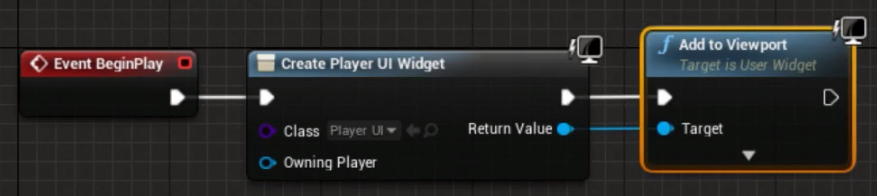

- Make the reticule visible
	+ BattleTankGameMode_BP
	+ Player Controller Class
		* TankPlayerController_BP

### Main Menu Screens

- Create a new level called MainMenu Level
- Create Widget Blueprint called MainMenu_BP
	+ edit and add a quick test image
- Edit the MainMenu Level BP
	+ Event BeginPlay
	+ Create Widget
		* to display start screen image
	+ Add to Viewport
- Apply a background image


### UI Scale Box, Buttons & Mouse

- MainMenu Level BP
- How to show the Player Mouse
- GetPlayerController
- SetShowMouseCursor

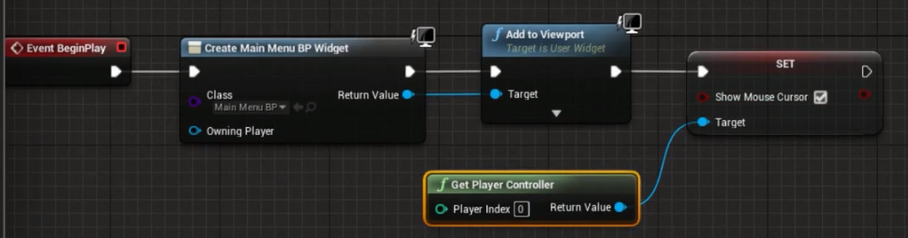

### Controller Ready Navigation

- MainMenu_BP Viewport
	+ Start Button widget
		* Events
			- OnClicked


- MainMenu_BP Event Graph
	+ Wire up opening a level
		* OpenLevel node
	+ Focus the Start Button automatically
		* WidgetReady
- MainMenu Level BP
	+ Wire up WidgetReady event at the end of the control graph
- MainMenu_BP Event Graph
	+ create Start Button node
	+ create Get Player Controller node
	+ create Set Input Mode UIOnly node


- Create a Game Quit Action
- Project -> Engine Input -> Action Mapping
	+ Game Pad Special Left Button
		* The back button on an XBox controller
- BattleGround Level BP
	+ Wire up Action Quit

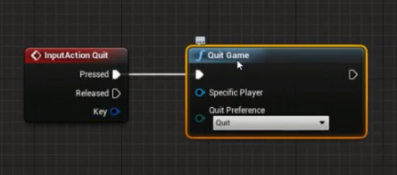

### Trial Packaging Your Game

- Project Settings -> Maps and Modes
	+ Game Default Map
	+ Editor Startup Map
- File -> Package Project -> Windows 64 bit
- Problem: Set Input Mode UIOnly
	+ Mode never switches over to Game Only

## Mid-Section Quiz

### Delegating to Components

- Create a Tank C++ Class

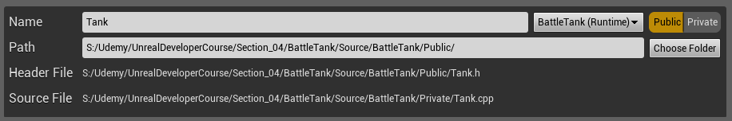

- Create a TankPlayerController C++ Class

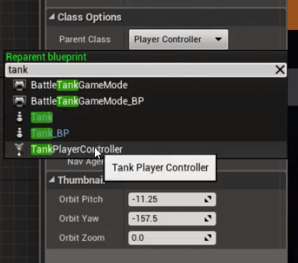

### Using Virtual and Override

- Backstory: what pawn are we possessing when starting the game?
- Try Logging from a Blueprint


- Take a look at APlayerController and the AActor parent

[APlayerController Unreal Doc](https://docs.unrealengine.com/latest/INT/API/Runtime/Engine/GameFramework/APlayerController/index.html)

- `virtual void BeginPlay()`
- need to override, what is the syntax?
- `void BeginPlay() override;`
- `virtual` ancestors are allowed to override
- in implementation `Super::BeginPlay()`
- Same setup in Tank boilerplate code

### Overloading and Polymorphism

- Polymorphism
	+ Ad-hoc = A different implementation per signature, same signature different implementation
	+ Subtype = Parent pointers pointing at children instances
	+ Parametric = One implementation, multiple signatures
	+ [Blog about cpp polymorphism](http://www.catonmat.net/blog/cpp-polymorphism/)

### Virtual Functions and Vtables

- [Compiler Explorer](https://godbolt.org/)
- [YT video](https://www.youtube.com/watch?v=bSkpMdDe4g4)
- Assembly code and a view for Binary instructions!
- Find out just how many more lines of Assembly virual will take
- Assembly code methods are labels
- Experiment by removing `virtual` + overrides
	+ Observations
	+ code is shorter
	+ `animal.MakeNoise()`
		* right click on the line, scroll to assembly
		* Assembly is actually only one line of code
		* it is actually an address in memory (400cf4)

- virtual
- Vtable lookup the address of MakeNoise function for the type of animal
	+ Animal -> Cat Vtable -> Cat::MakeNoise()
	+ Animal -> Dog Vtable -> Dog::MakeNoise()
	+ If another Cat then share the same Cat Vtable
- insert virtual back into the source code

```cpp
// 2. subtype polymorphism (AKA runtime polymorphism)
class Animal
{
public:
	virtual void MakeNoise()
	{
		std::cout << "???" << std::endl;
	}
};
```

- notice vtable in assembly

```
vtable for Kitteh:
  .quad 0
  .quad typeinfo for Kitteh
  .quad Kitteh::MakeNoise()
```

- more 'hops' involved when using virtual
- cpp mantra "don't pay for what you don't use"

### Creating an AI Controller Class

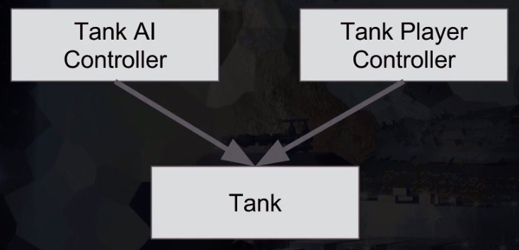

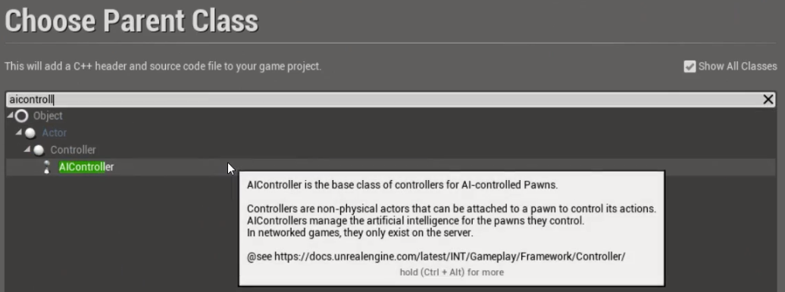

- Create a TankAIController
- Auto Possess [with] AI


- At Game Start multiple pawns get possessed by TankAIController


### Get the Player Controller with C++

- AimAt(Player)


```cpp
ATank* ATankAIController::GetPlayerTank() const
{
	auto PlayerPawn = GetWorld()->GetFirstPlayerController()->GetPawn();
	if (!PlayerPawn){ return PlayerPawn; }
	return Cast<ATank>(PlayerPawn);
}
```

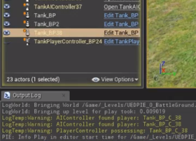

### Add `Tick()` to Player Controller

- AimAt(Crosshair)

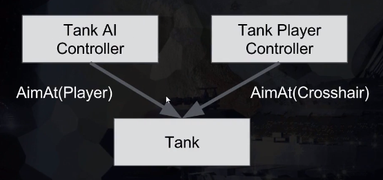

```cpp
void ATankPlayerController::AimAtCrosshair()
{
	if (!GetControlledTank()) { return; }

	// Get world location of linetrace through crosshair
	// If it hits the landscape
		// Tell controlled tank to aim at this point
}
```

### Creating an Out Parameter Method

```cpp
// Get world location of linetrace through crosshair, true if hits landscape
bool GetSightRayHitLocation(FVector& OutHitLocation) const
{
	OutHitLocation = FVector(1.0);
	return true;
}
```

### Finding Screen Pixel Coordinates

- **Objective**: Find crosshair location on the screen

```cpp
/// TankPlayerController.h

// location left/right
UPROPERTY(EditAnywhere)
float CrosshairXLocation = 0.5;

// location from top down
UPROPERTY(EditAnywhere)
float CrosshairYLocation = 0.3333;
```

```cpp
/// TankPlayerController.cpp

// Find crosshair location
	int32 ViewportSizeX, ViewportSizeY;
	GetViewportSize(ViewportSizeX, ViewportSizeY);
	auto ScreenLocation = FVector2D(ViewportSizeX * CrosshairXLocation, ViewportSizeY * CrosshairYLocation);
```

### Using `DeprojectScreenToWorld`

- **Objective**: Get world space direction as a unit vector


- [DeprojectScreenPositionToWorld Unreal Doc](https://docs.unrealengine.com/latest/INT/API/Runtime/Engine/GameFramework/APlayerController/DeprojectScreenPositionToWorld/index.html)

```cpp
/// TankPlayerController.h

bool GetLookDirection(FVector2D ScreenLocation, FVector& LookDirection) const;
```

```cpp
/// TankPlayerController.cpp

bool ATankPlayerController::GetLookDirection(FVector2D ScreenLocation, FVector & LookDirection) const
{
	FVector CameraWorldLocation; // TODO: discard
	return DeprojectScreenPositionToWorld(
		ScreenLocation.X,
		ScreenLocation.Y,
		CameraWorldLocation,
		LookDirection
	);
}
```

### Using `LineTraceSingleByChannel`

- **Objective**: Get an actual point in the world to aim at
 


- [LineTraceSingleByChannel Unreal Doc](https://docs.unrealengine.com/latest/INT/API/Runtime/Engine/Engine/UWorld/LineTraceSingleByChannel/index.html)

```cpp
/// TankPlayerController.h

UPROPERTY(EditAnywhere)
float LineTraceRange = 1000000;

bool GetLookVectorHitLocation(FVector LookDirection, FVector& HitLocation) const;
```

```cpp
/// TankPlayerController.cpp

bool ATankPlayerController::GetLookVectorHitLocation(FVector LookDirection, FVector & HitLocation) const
{
	FHitResult HitResult;
	auto StartLocation = PlayerCameraManager->GetCameraLocation();
	auto EndLocation = StartLocation + (LookDirection * LineTraceRange);

	if (GetWorld()->LineTraceSingleByChannel(
		HitResult,
		StartLocation,
		EndLocation,
		ECollisionChannel::ECC_Visibility))
	{
		HitLocation = HitResult.Location;
		return true;
	}
	
	return false;
}
```

### Unify Player and AI Aiming

- **Objective**: Call same `AimAt()` method whether it is a player controller or an AI controller possessing a tank

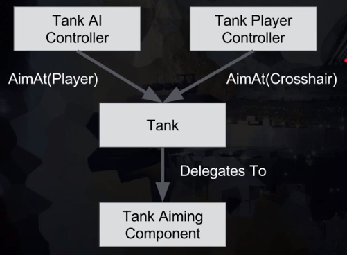

- Create `AimAt` method on the Tank class

```cpp
/// Tank.h

public:
	void AimAt(FVector HitLocation);
```

```cpp
/// Tank.cpp

void ATank::AimAt(FVector HitLocation)
{
	auto OurTankName = GetName();
	UE_LOG(LogTemp, Warning, TEXT("%s aiming at %s"), *OurTankName, *HitLocation.ToString())
}
```

- Call the method from the player controller

```cpp
/// TankPlayerController.cpp

void ATankPlayerController::AimAtCrosshair()
{
	if (!GetControlledTank()) { return; }

	FVector HitLocation;
	if (GetSightRayHitLocation(HitLocation))
	{
		GetControlledTank()->AimAt(HitLocation);
	}
}
```

- Add a `Tick` method, call same `AimAt` method every frame to aim at the player

```cpp
/// TankAIController.h

private:
	virtual void Tick(float DeltaTime) override;
```

```cpp
/// TankAIController.cpp

void ATankAIController::Tick(float DeltaTime)
{
	Super::Tick(DeltaTime);

	if (GetPlayerTank())
	{
		// Move towards the player
		
		// Aim towards the player
		GetControlledTank()->AimAt(GetPlayerTank()->GetActorLocation());

		// Fire when ready
	}
}
```

- Using the same `AimAt` method is automatically equitable game play, fair, and balanced.


## Mid-Section Quiz

### Creating Default Sub Objects in C++

- **Objective**: Create an Aiming Component in C++ and Delegate aiming to it

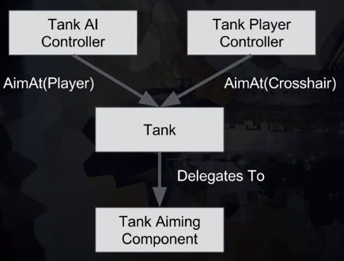

1. Create the Aiming Component Default Subobject and add it to the Tank

```cpp
/// Tank.h

// Create in UnrealEd and hash include this Actor Component
#include "TankAimingComponent.h"

UCLASS()
class BATTLETANK_API ATank : public APawn
{
	GENERATED_BODY()

public:
	// Aiming code

protected:
	// Cannot make private, would cause compile error and shouldn't be public
	UTankAimingComponent* TankAimingComponent = nullptr;

private:
	// Private code
}
```

```cpp
/// Tank.cpp

ATank::ATank()
{
 	// Tick code

	// Pointer protection not needed since created during construction
	TankAimingComponent = CreateDefaultSubobject<UTankAimingComponent>(FName("AimingComponent"));
}
```

2. Delegate `AimAt()` to the Aiming Component instead of Tank

```cpp
/// TankAimingComponent.h

// Macro Boilerplate code
class BATTLETANK_API UTankAimingComponent : public UActorComponent
{
	GENERATED_BODY()

public:	
	// Boilerplate code

	// Tick Component code

	void AimAt(FVector HitLocation);
}

```

```cpp
/// TankAimingComponent.cpp

void UTankAimingComponent::AimAt(FVector HitLocation)
{	
	// `GetOwner()` grab the parent's name, just `GetName()` when implemented in Tank.cpp
	auto OurTankName = GetOwner()->GetName();
	UE_LOG(LogTemp, Warning, TEXT("%s aiming at %s"), *OurTankName, *HitLocation.ToString())
}
```

3. Call the method on the `TankAimingComponent`

```cpp
/// Tank.cpp

// Much simpler `AimAt` method delegated to the component
void ATank::AimAt(FVector HitLocation)
{
	TankAimingComponent->AimAt(HitLocation);
}
```

### `BlueprintCallable()`

- **Objective**: Find start and end location of the projectile

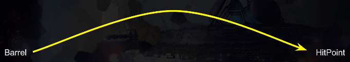

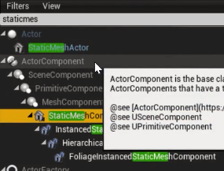


1. Declare `SetBarrelReferenced`

```cpp
/// TankAimingComponent.h

#include "Components/StaticMeshComponent.h"

/// Macro here
class BATTLETANK_API UTankAimingComponent : public UActorComponent
{
	/// Boilerplate here

public:	
	/// Other methods here

	// Method for setting the barrel reference
	void SetBarrelReference(UStaticMeshComponent * BarrelToSet);
protected:
	// protected code
private:
	// initialize default barrel pointer
	UStaticMeshComponent * Barrel = nullptr;
}
```

2. Implement `SetBarrelReference`

```cpp
/// TankAimingComponent.cpp

// implementation for setting the barrel reference
void UTankAimingComponent::SetBarrelReference(UStaticMeshComponent * BarrelToSet)
{
	Barrel = BarrelToSet;
}
```

- Make it possible to call C++ function from Blueprint

```cpp
/// Tank.h

/// Macro here
class BATTLETANK_API ATank : public APawn
{
	/// Boilerplate here
public:
	// Create a BlueprintCallable method
	UFUNCTION(BlueprintCallable, category=Setup)
	void SetBarrelReference(UStaticMeshComponent * BarrelToSet);
protected:
	// protected code
private:
	// private code
}
```

```cpp
/// Tank.cpp

// Delegate out setting the barrel reference
void ATank::SetBarrelReference(UStaticMeshComponent * BarrelToSet)
{
	TankAimingComponent->SetBarrelReference(BarrelToSet);
}
```

3. Logging out the Barrel Component Location

```cpp
/// TankAimingComponent.cpp

void UTankAimingComponent::AimAt(FVector HitLocation)
{
	auto OurTankName = GetOwner()->GetName();
	// Now we can get the barrel component location
	auto BarrelLocation = Barrel->GetComponentLocation();
	UE_LOG(LogTemp, Warning, TEXT("%s aiming at %s from %s"), *OurTankName, *HitLocation.ToString(), *BarrelLocation.ToString())
}
```

### `SuggestProjectileVelocity()`

- **Objective**: Understand launch velocity

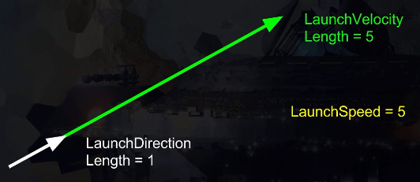

[Wikipedia Projectile Motion](https://en.wikipedia.org/wiki/Projectile_motion)

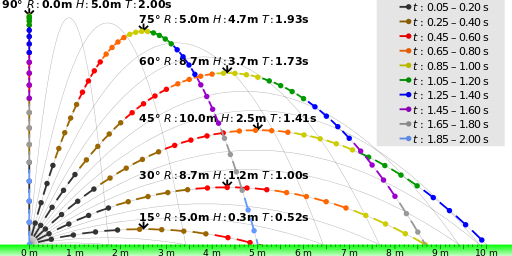

[SuggestProjectileVelocity Learn Doc](https://docs.unrealengine.com/latest/INT/BlueprintAPI/Game/Components/ProjectileMovement/SuggestProjectileVelocity/index.html)

[SuggestProjectileVelocity C++ Doc](https://docs.unrealengine.com/latest/INT/API/Runtime/Engine/Kismet/UGameplayStatics/SuggestProjectileVelocity/index.html)

1. Setup a `LaunchSpeed` parameter

```cpp
/// Tank.h

/// Macros here
class BATTLETANK_API ATank : public APawn
{
	/// Boilerplate
public:
	// Tank doesn't care about `LaunchSpeed` or other aiming parameters
	void AimAt(FVector HitLocation);
	// More code
protected:
	// Protected code
private:
	// Create a new property that will show up in a new
	// Firing category on the Blueprint which will 
	// allow us to experiment with different launch speeds
	UPROPERTY(EditAnywhere, category=Firing)
	float LaunchSpeed = 100000; // 1000 m/s
};

```

2. Pass the `LaunchSpeed` to `TankAimingComponent` `AimAt()`

```cpp
/// Tank.cpp

void ATank::AimAt(FVector HitLocation)
{
	TankAimingComponent->AimAt(HitLocation, LaunchSpeed);
}
```

3. Add the new parameter to the aiming component

```cpp
/// TankAimingComponent.h

/// Macro here
class BATTLETANK_API UTankAimingComponent : public UActorComponent
{
	/// Boilerplate here
public:	
	void AimAt(FVector HitLocation, float LaunchSpeed);
protected:
	// protected code
private:
	// private code
}
```

4. Log out the `LaunchSpeed` parameter's value

```cpp
/// TankAimingComponent.cpp

void UTankAimingComponent::AimAt(FVector HitLocation, float LaunchSpeed)
{
	UE_LOG(LogTemp, Warning, TEXT("Firing at %.2f cm/s"), LaunchSpeed)
}
```

### Predict Projectile Landing Point

- **Objective**: Get the `AimDirection`: where we should be aiming our barrel

```cpp
/// TankAimingComponent.cpp

#include "Kismet/GameplayStatics.h"
#include "Kismet/GameplayStaticsTypes.h"

void UTankAimingComponent::AimAt(FVector HitLocation, float LaunchSpeed)
{
	// protect pointers
	if (!Barrel) { return; }

	// Out parameter, in engine code all are prefixed "Out"
	FVector OutLaunchVelocity;
	// Create a socket in Unreal on the barrel first
	// The start location is the projectile location
	FVector StartLocation = Barrel->GetSocketLocation(FName("Projectile"));

	// https://docs.unrealengine.com/latest/INT/API/Runtime/Engine/Kismet/UGameplayStatics/SuggestProjectileVelocity/index.html
	if (UGameplayStatics::SuggestProjectileVelocity(
				this,
				OutLaunchVelocity,
				StartLocation,
				HitLocation,
				LaunchSpeed,
				false,
				0.0,
				0.0,
				ESuggestProjVelocityTraceOption::DoNotTrace	
			)
		)
	{
		// Direction of the Vector provided
		// Getting the "Unit Vector"
		auto AimDirection = OutLaunchVelocity.GetSafeNormal();
		auto TankName = GetOwner()->GetName();
		UE_LOG(LogTemp, Warning, TEXT("%s aiming at %s"), *TankName, *AimDirection.ToString())
	}
	// do nothing if unsuccessful
}
```

### Using `FRotators` in Unreal

- **Objective**: Control the Roll, Pitch, and Yaw of barrel

***NOTE***: A vector that points equally down the X and Y axis is "Yawed" by 45 degrees clockwise as seen from above. Note Roll may be null as we have said nothing about Roll so it can't be inferred (we're pointing the arrow not rotating it when we create the FVector)

1. Create a Barrel Class


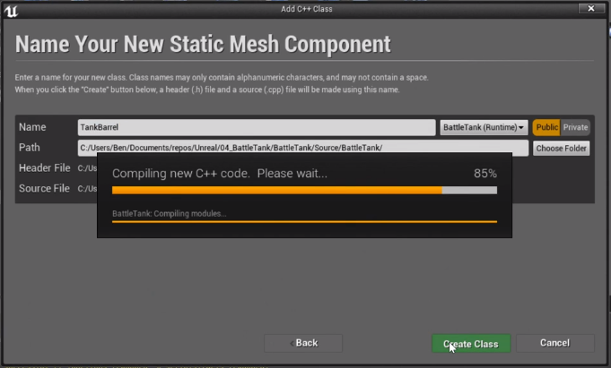

2. Create the `MoveBarrelTowards` method
3. Work out what `MoveBarrelTowards` needs to do

**The pseudo-code** 

- Get the difference between the current barrel rotation and `AimDirection`
- Move the barrel the correct amount this frame
- Given a max elevation speed, and the frame time

```cpp
/// TankAimingComponent.h
// Macro here
class BATTLETANK_API UTankAimingComponent : public UActorComponent
{
	// Boilerplate
public:	
	// public code
private:
	void MoveBarrelTowards(FVector AimDirection);
};
```

```cpp
/// TankAimingComponent.cpp

void UTankAimingComponent::AimAt(FVector HitLocation, float LaunchSpeed)
{
	// Code to get projectile velocity here
	// Get the result as `bHaveAimSolution`

	// Call `MoveBarrelTowards()` where we used to log out information
	if (bHaveAimSolution) {
		auto AimDirection = OutLaunchVelocity.GetSafeNormal();
		MoveBarrelTowards(AimDirection);
	}
}

void UTankAimingComponent::MoveBarrelTowards(FVector AimDirection)
{
	auto BarrelRotator = Barrel->GetForwardVector().Rotation();
	auto AimAsRotator = AimDirection.Rotation();
	auto DeltaRotator = AimAsRotator - BarrelRotator;
	Barrel->Elevate(5);
}
```

4. It is at this time that we need to search/replace in Tank (h and cpp) and TankAimingComponent (h and cpp) `UStaticMeshComponent * Barrel` with `UTankBarrel * Barrel` and `UStaticMeshComponent * BarrelToSet` with `UTankBarrel * BarrelToSet`
5. Hash include `TankBarrel.h` in `TankAimingComponent.cpp` is not necessary because we are calling a method on the `TankBarrel` class

### The C++ Compilation Process

- **Objective**: Understand the best way to import header files


### Using Forward Declarations

- **Objective**: Create Barrel Class and Barrel `Elevate` method

1. Create Forward Declarations in h files

```cpp
/// Tank.h

// Forward Declaration, enable referencing of the type in class decaration
class UTankBarrel;
```

```cpp
/// TankAimingComponent.h

// Forward Declaration, enable referencing of the type in class decaration
class UTankBarrel;
```

2. Update the cpp files' hash includes if necessary

```cpp
/// Tank.cpp

// No methods called on `TankBarrel`, no need to hash include `TankBarrel.h`
#include "Tank.h"
```

```cpp
/// TankAimingComponent.cpp

// `MoveBarrelTowards()` calls `TankBarrel` `Elevate` method, need to hash include `TankBarrel.h` in the cpp file
#include "TankBarrel.h"
```

### `BlueprintSpawnableComponent()`

- **Objective**: Replace the `UStaticMeshComponent` class with `TankBarrel` C++ class as input to the `Set Barrel Reference` Unreal Function in the Event Graph for Tank_BP and add some setup Unreal Properties to the `TankBarrel`


1. Make TankBarrel show up in Unreal's Add Component menu by adding `BlueprintSpawnableComponent` to the class definition

```cpp
/// TankBarrel.h

UCLASS(meta = (BlueprintSpawnableComponent))
class BATTLETANK_API UTankBarrel : public UStaticMeshComponent
{
	// Class Definition code
}
```


2. Replace the StaticMeshComponent Barrel with the new TankBarrel component and drag that component to the Event Graph
3. Hook up the new Barrel to the Unreal Function Input
4. Re-assign Static Mesh of the Barrel
5. Verify new Setup properties exist on the new Barrel

```cpp
/// TankBarrel.h

// Sometimes useful to hide categories in UEd from designers for instance "Collision"
UCLASS(meta = (BlueprintSpawnableComponent), hidecategories = ("Collision"))
```

### Review Our Execution Flow

- **Objective**: Zoom out of the details and examine the Call Stack


1. `DegreesPerSecond` is wrong, change `Elevate(float DegreesPerSecond)` to `Elevate(float RelativeSpeed)`
2. `RelativeSpeed` is +-1 max speed


3. Player/AI Controller need a tick, as well as Tank Aiming Component
4. Tank Does not need a tick to get rid of it in Tank h and cpp files

5. Print the time to verify method is called every tick

```cpp
/// TankBarrel.cpp

void UTankBarrel::Elevate(float RelativeSpeed)
{
	auto Time = GetWorld()->GetTimeSeconds();
	UE_LOG(LogTemp, Warning, TEXT("%.2f: Rotate at speed: %f"), Time, RelativeSpeed)
}
```

6. Verify: Does the `TankAimingComponent` really need to tick?
7. Figure out: Aiming logs stop intermittently, could it be the Aiming Solution? Change the logs to figure out why.

### How to Report Bugs

- **Objective**: Fix the Aim Solution bug, report it to Unreal
	+ [Unreal Answer Hub](https://answers.unrealengine.com/index.html)

1. Solution: Default parameters not being specified in `SuggestProjectileVelocity`
2. Problem is in 4.11 and 4.12
3. To report, comment and upload code to GitHub and share the commit link with Unreal

```cpp
/// TankAimingComponent.cpp

bool bHaveAimSolution = UGameplayStatics::SuggestProjectileVelocity(
		this,
		OutLaunchVelocity,
		StartLocation,
		HitLocation,
		LaunchSpeed,
		false, // <--
		0,     // <--
		0,     // <--
		ESuggestProjVelocityTraceOption::DoNotTrace	
);
```

- **Second Objective**: Move to Forward Delarations in all .h files

1. `#includes Tank.h` in multiple h files, declare `class ATank;` in each header and hash include `Tank.h` in each cpp file

## Mid-Section Quiz

### Using `Clamp()` to Limit Values

- **Objective**: Rotate the TankBarrel but clamp rotations to a maximum value

- If values are plugged in manually for `SetRelativeRotation()` then the problem we need to solve is visible by playing the game. The barrel rotates beyond the maximum elevation and does not stop rotating at around 8 seconds (calculation based on `MaxDegreesPerSecond`)

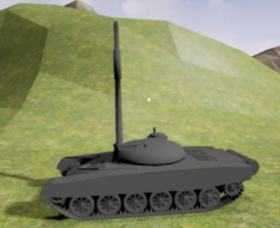

- Use the `FMath` struct's `Clamp` function to clamp the elevate speed to +/-1
- Calculate the `ElevationChange` using `GetWorld()->DeltaTimeSeconds` to get current time in seconds
- Also `Clamp` the degree of elevation to the values set in the blueprint 0 -> 40

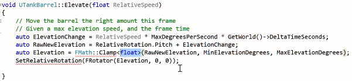

- Test it works, play game, deposess the tank and inspect it's details


### CHALLENGE - Turret Rotation

- **Objective**: Make the turret rotate

- To get started, what we would like to see in the UI is the Turret class along side the Barrel Class. Then we need to make a `BlueprintCallable` function we can use in the Event Graph.

1. Create the TankTurret C++ Class

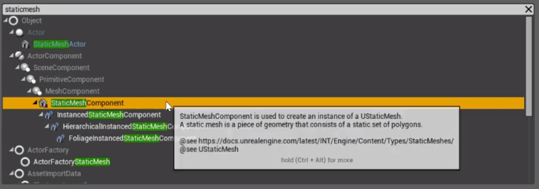


2. Add the `UCLASS(meta = (BlueprintSpawnableComponent))` macro

```cpp
/// TankTurret.h

// Add `BlueprintSpawnableComponent` macro
UCLASS(meta = (BlueprintSpawnableComponent))
class BATTLETANK_API UTankTurret : public UStaticMeshComponent
{ //Class Definition
}
```


3. Create `SetTurretReference` `BlueprintCallable` function in `Tank.h` and create the implementation

4. Create forward declaration of `UTankTurret` in `Tank.h`

```cpp
/// Tank.h

// Forward declaration
class UTankTurret;

/// Macro here
class BATTLETANK_API ATank : public APawn
{
	// Boilerplate code here

public:
	// Add `BlueprintCallable` function
	UFUNCTION(BlueprintCallable, category = Setup)
		void SetTurretReference(UTankTurret * TurretToSet);

	// Class definition continued...
}
```

```cpp
/// Tank.cpp

// Deleget `SetTurretReference` to the `TankAimingComponent`
void ATank::SetTurretReference(UTankTurret * TurretToSet)
{
	TankAimingComponent->SetTurretReference(TurretToSet);
}
```

5. `TankAimingComponent.h` create a `void SetTurretReference(UTankTurret * TurretToSet);`

6. `TankAimingComponent.h` create a `UTankTurret * Turret = nullptr;`

7. `TankAimingComponent.h` forward declaration `class UTankTurret;`


```cpp
/// TankAimingComponent.h

// Forward declaration
class UTankTurret;


/// Macro here
class BATTLETANK_API UTankAimingComponent : public UActorComponent
{
	// Boilerplate code here

public:
	// Delegated `SetTurretReference`
	void SetTurretReference(UTankTurret * TurretToSet);
	// More code here
private:
	UTankTurret* Turret = nullptr;
	// Class definition continued...
}
```

8. `TankAimingComponent.cpp` create a `void UTankAimingComponent::SetTurretReference(UTankTurret * TurretToSet)`

9. `TankAimingComponent.cpp` hash include `#include "TankTurret.h"`

```cpp
/// TankAimingComponent.cpp

// Forward declarations require us to hash include the header
#include "TankTurret.h"


void UTankAimingComponent::SetTurretReference(UTankTurret * TurretToSet)
{
	if (!TurretToSet) { return; }
	Turret = TurretToSet;
}
```

- Now we are able to create the function in `Tank_BP`

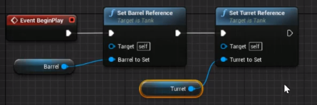

### CHALLENGE - Turret Rotation Pt 2

- **Objective**: Get fully operational and game play tested Rotation

1. Create `Rotation` method
2. Create the MaxDegreesPerSecond Property

```cpp
/// TankTurret.h

//Macro here
class BATTLETANK_API UTankTurret : public UStaticMeshComponent
{
	// Boilerplate here
public:
	void Rotate(float RelativeSpeed);

private:
	UPROPERTY(EditDefaultsOnly, Category = Setup)
	float MaxDegreesPerSecond = 25;
}
```

```cpp
/// TankTurret.cpp

void UTankTurret::Rotate(float RelativeSpeed)
{
	auto RelativeSpeedClamped = FMath::Clamp<float>(RelativeSpeed, -1., 1.);
	auto RotationChange = RelativeSpeedClamped * MaxDegreesPerSecond * GetWorld()->DeltaTimeSeconds;
	auto Rotation = RelativeRotation.Yaw + RotationChange;
	SetRelativeRotation(FRotator(0, Rotation, 0));
}
```

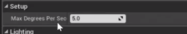

3. To get the Turret, the control stack will be similar to Aiming


```cpp
/// TankAimingComponent.cpp

void UTankAimingComponent::MoveBarrelTowards(FVector AimDirection)
{
	// Aiming code here

	// Finally call Rotate
	Turret->Rotate(DeltaRotator.Yaw);
}
```

4. Test some values in Blueprint for Elevation and Rotation values then push the values into C++ so that if designer creates more tanks the default values will all be the same.

5. Address the TODO find out if Aiming Component needs to tick optimization. In the video, it is not necessary but in my case it IS necessary

### Setting Up Projectiles

- **Objective**: Move beyond the Tank and focus on firing

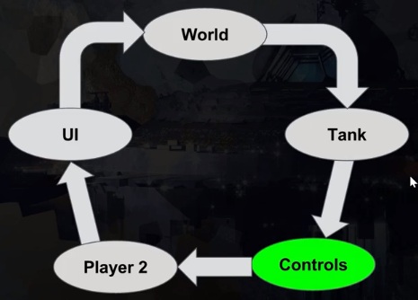

1. Set up Firing control setting in Project Settings

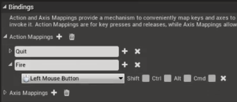

2. Create Fire BlueprintCallable method in C++

```cpp
/// Tank.h

/// Macro here
class BATTLETANK_API ATank : public APawn
{
	// Boilerplate code here
public:
	// Add `BlueprintCallable` function
	UFUNCTION(BlueprintCallable, category = Firing)
	void Fire();
}
```

```cpp
/// Tank.cpp

void ATank::Fire()
{
	// Log out which Tank is firing
	UE_LOG(LogTemp, Warning, TEXT("%s Firing"), *this->GetName())
}
```

3. Edit the Input Binding Setup in Tank_BP

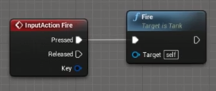

- **Next Achievement**: Create a projectile and fire it

1. Projectile deserves its own C++ class because it will have many attributes


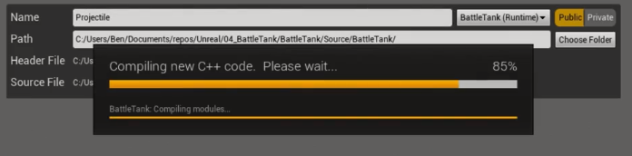

2. Create a Projectile_BP from C++ Class


### Upgrading to Unreal 4.2

- **Objective**: Install 4.2, Test Game

### Working Around Awkward Bugs

- **Objective**: Stop an annoying bug that manifests after upgrading engine version

### Using `SpawnActor<>()` to Spawn

- **Objective**: Spawn projectiles at the end of the barrel

- [TSubclassOf docs](https://docs.unrealengine.com/latest/INT/Programming/UnrealArchitecture/TSubclassOf/)

- Before getting started add a Sphere with a scale of 1 to the Projectile_BP, Save All

- First Achievement: Instantiate Projectile from code

1. Create A `BlueprintCallable` Property on the Tank class that we can set the Projectile with, remember forward delaration of `AProjectile`

```cpp
/// Tank.h

// Forward declarations
// more declarations here
class AProjectile;

/// Macro here
class BATTLETANK_API ATank : public APawn
{
	// Boilerplate code here
public:
	// public code here
protected:
	// protected code here
private:
	// Set the `BlueprintCallable` property for the projectile
	UPROPERTY(EditDefaultsOnly, category = Setup)
	TSubclassOf<AProjectile> ProjectileBlueprint;
}
```

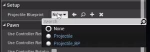

2. Declare a reference to the barrel in the Tank class for spawning a projectile off of `UTankBarrel* Barrel = nullptr;`
3. Create socket location on the Barrel called "Projectile"
4. Spawn actor in the `ATank::Fire()` method

```cpp
/// Tank.cpp

#include "Projectile.h"


void ATank::Fire()
{	
	// ...

	// Spawn a projectile at the socket on the barrel
	auto Projectile = GetWorld()->SpawnActor<AProjectile>(
		ProjectileBlueprint,
		Barrel->GetSocketLocation(FName("Projectile")),
		Barrel->GetSocketRotation(FName("Projectile"))
	);

	// ...
}
```

- **Achievement Unlocked!**


### Projectile Moving Components

- **Objective**: Add a Movement Component to the projectile much the same way we added Aiming Component to the Tank

1. Add Projectile Movement Component, first what is it called?

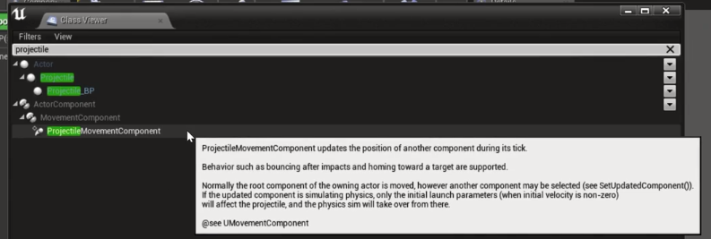

2. set `bAutoActivate` to false

```cpp
/// Projectile.h

#include "GameFramework/ProjectileMovementComponent.h"

// Macro here
class BATTLETANK_API AProjectile : public AActor
{
	// Boilerplate code
	
public:	
	// public code here

protected:
	// protected code here
private:
	// Declare the Movement Component
	UProjectileMovementComponent * ProjectileMovementComponent = nullptr;
};
```

```cpp
/// Projectile.cpp

#include "Projectile.h"

// Sets default values
AProjectile::AProjectile()
{
 	// Set this actor to call Tick() every frame.  You can turn this off to improve performance if you don't need it.
	PrimaryActorTick.bCanEverTick = true;

	ProjectileMovementComponent = CreateDefaultSubobject<UProjectileMovementComponent>(FName("MovementComponent"));
	ProjectileMovementComponent->bAutoActivate = false;
	
}
```


3. Create the lauch projectile method and call it in `Tank.cpp`

```cpp
/// Projectile.h

#include "GameFramework/ProjectileMovementComponent.h"

// Macro here
class BATTLETANK_API AProjectile : public AActor
{
	// Boilerplate code
public:	
	// Launch projectile method
	void LaunchProjectile(float Speed);

// Class delaration continued...
};
```

```cpp
void AProjectile::LaunchProjectile(float Speed)
{
	auto TankName = GetOwner()->GetName();
	UE_LOG(LogTemp, Warning, TEXT("%s Firing at speed %f"), *TankName, Speed)
}
```

```cpp
/// Tank.cpp

void ATank::Fire()
{	
	// ...

	// Spawn a projectile at the socket on the barrel

	// Fire the projectile
	Projectile->LaunchProjectile(LaunchSpeed);

	// ...
}

```

4. Actually launch the projectile
5. Since `ProjectileMovementComponent->bAutoActivate = false;` we need to set the velocity then call `Activate()`

```cpp

void AProjectile::LaunchProjectile(float Speed)
{
	// Log firing

	// Launch
	ProjectileMovementComponent->SetVelocityInLocalSpace(FVector::ForwardVector * Speed);
	ProjectileMovementComponent->Activate();
}
```

### Making AI Tanks Fire

- **Objective**: Limit firing rate, make the Tank AI fire at the Player Tank

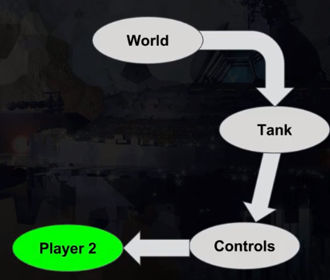

1. Defactor or Inline refactored code and remove logging code in BeginPlay

- Start off firing every tick in `UTankAimingComponent::AimAt`

```cpp
/// TankAIController.cpp

void ATankAIController::Tick(float DeltaTime)
{
	Super::Tick(DeltaTime);

	// Inlining what was previously 2 methods
	auto ControlledTank = Cast<ATank>(GetPawn());
	auto PlayerTank = Cast<ATank>(GetWorld()->GetFirstPlayerController()->GetPawn());

	if (PlayerTank)
	{
		// Move towards the player
		
		// Aim towards the player
		ControlledTank->AimAt(PlayerTank->GetActorLocation());

		// TODO: limit firing rate
		ControlledTank->Fire();
	}
}
```

2. Limit the firing rate by declaring `ReloadTimeInSeconds` on the Tank and make it a `UPROPERTY` (in the videos this doesn't happen until next lecture)

```cpp
/// Tank.h

// Forward declarations
// more declarations here
class AProjectile;

/// Macro here
class BATTLETANK_API ATank : public APawn
{
	// Boilerplate code here
public:
	// public code here
protected:
	// protected code here
private:
	// declare ReloadTimeInSeconds
	UPROPERTY(EditDefaultsOnly, category = Firing)
	float ReloadTimeInSeconds = 3;
// Class declaration continued...
}
```

3. Create a timer and only fire when the timer expires

```cpp
/// Tank.h
/// Macro here
class BATTLETANK_API ATank : public APawn
{
	// ...
private:
	// ...
	double LastFireTime = 0;
	// ...
}
```

```cpp
/// Tank.cpp

void ATank::Fire()
{	
	bool isReloaded = (FPlatformTime::Seconds() - LastFireTime) > ReloadTimeInSeconds;

	if (Barrel && isReloaded)
	{
		// Spawn a projectile at the socket on the barrel

		// Fire the projectile

		// Reset timer
		LastFireTime = FPlatformTime::Seconds();
	}
	// ...
}
```


### `EditAnywhere` vs `EditDefaultsOnly`


- **Objective**: Start using EditDefaultsOnly and examine the effects

- *Note from previous*: `FPlatformTime::Seconds()` is time that begins some time in the past

- EditAnywhere: Editable on any tank instance

- EditDefaultsOnly: Editable only on the Tank_BP
	+ most sensible choice for all game properties created up until this point


## Mid-Section Quiz

### Adding a Quit Button

- **Objective**:

### Setup Track Throttles

- **Objective**:

### `ApplyForceAtLocation()` in Action

- **Objective**:

### Physics Materials and Friction

- **Objective**:

### Fly-By-Wire Control System

- **Objective**:

### Using BluePrintReadOnly

- **Objective**:

### A Better Component Architecture

- **Objective**:

### Completing Manual Tank Movement

- **Objective**:

### Introducing AI Pathfinding

- **Objective**:

### Dissecting `RequestDirectMove()`


- **Objective**:

## Mid-Section Quiz

### DotProduct() Vector Operator

- **Objective**:

### CrossProduct() Vector Operator

- **Objective**:

### Finalizing Your Class Code

- **Objective**:

### How to Use Blueprint Variables

- **Objective**:

### Using Enum(erations) in UE4

- **Objective**:

### Refactoring our Aiming Component

- **Objective**:

### Attaching a Debugger to Unreal

- **Objective**:

### Constructor and Begin Play Timing

- **Objective**:

### Decoupling Your Architecture

- **Objective**:

### `BlueprintImplementableEvent`

- **Objective**:

## Mid-Section Quiz

### Using the ensure Assertion

- **Objective**:

### Dependency Mapping

- **Objective**:

### Talking Head - Real World Skills

- **Objective**:

### Starting From Green

- **Objective**:

### Aiming Without the Tank

- **Objective**:

### Finish Our Refactoring

- **Objective**:

### Adding TickComponent() Back

- **Objective**:

### Are Two Floats Equal?

- **Objective**:

### Programmatic Sideways Friction

- **Objective**:

### OnComponentHit Event in 4.12

- **Objective**:

### Avoiding Boolean Flags

- **Objective**:

## Mid-Section Quiz

### Improving Tank Aiming

- **Objective**:

### Tweaking Tank AI

- **Objective**:

### Making an Ammo Display

- **Objective**:

### Making an AutoMortar

- **Objective**:

### Using the Reference Viewer

- **Objective**:

### Preparing for Particles

- **Objective**:

### Introducing Particle Systems

- **Objective**:

### Particle Bounding Boxes

- **Objective**:

### Using FAttachmentTransformRules

- **Objective**:

## Mid-Section Quiz

### Radial Forces & Caching

- **Objective**:

### Using GetTimerManager()

- **Objective**:

### Using TakeDamage() on Actors

- **Objective**:

### BlueprintPure & Health Bars

- **Objective**:

### The Observer Pattern

- **Objective**:

### Finishing Off - Part 1

- **Objective**:

### Finishing Off - Part 2

- **Objective**:

### Section 4 Wrap-Up

- **Objective**:

### Bonus - Switching Cameras

- **Objective**:

## End of Section Quiz
