# Section_04
:boom: Battle Tank :boom:

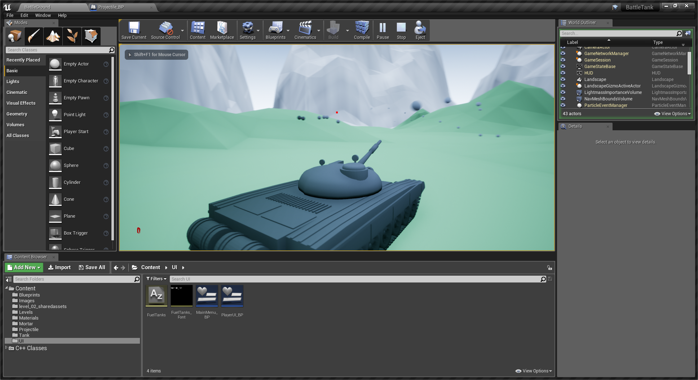

Hint: Make viewing this README an extra special experience with [Octopatcher](https://chrome.google.com/webstore/detail/octopatcher/lcilaoigfgceebdljpanjenhmnoijmal/related?hl=en-US&gl=US)

## Intro, Notes & Section 4 Assets

### Battle Tank Overview

### Game Design Document

- Concept, Rulese and Initial Requirements
- Iterate, ask what is least fun
- We aren't AAA studios
- World of Tanks

- Concepts
	+ Head to head combat game
- Rules
	+ Move anywhere in the terrain surrounded by mountains
	+ Both players infinite health and ammo
	+ Each direct hit takes away healt
	+ Last player standing wins
- Requirements (Assets)
	+ SFX: Gun fire, explosion, barrel moving, turret moving, engine sound
	+ Static Mesh: Simple tank, tracks, body, turret, barrel
	+ Textures
	+ Music

- Iterative cycle
	+ World -> Tank -> Controls -> Player 2 (human or AI) -> UI -> World


### Setting Up a GitHub Repo

- default UnrealEngine .gitignore

### Creating & Deleting Landscapes
### Landscape Setup & Scaling
### A Landscaping Process
### Upgrading Engine Version
### Using Landscape Layers
### Flat Shading Low Poly Landscapes
### More Landscaping Tools

## Mid-Section Quiz

### Tank Control System
### Actors from Multiple Meshes
### Configuring a Tank

- Viewport -> Blueprints -> World Override -> Game Mode -> Create -> BattleTankGameMode
- BattleTankGameMode_BP
- Default Pawn Class
- Tank_BP

### 3rd Person Camera Control

- Tank_BP Event Graph

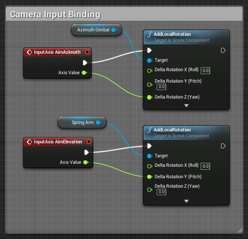

### User Interface (UI) in Unreal

- Create Aiming reticule
- Create Widget Blueprint called PlayerUI_BP
	+ Create a test image
	+ Edit scale and position of the reticule
- Create a Player Controller Blueprint class
	+ TankPlayerController_BP
- TankPlayerController_BP Event Graph
	+ Event BeginPlay
	+ Create Widget with class PlayerUI_BP
	+ Add to Viewport


- Make the reticule visible
	+ BattleTankGameMode_BP
	+ Player Controller Class
		* TankPlayerController_BP

### Main Menu Screens

- Create a new level called MainMenu Level
- Create Widget Blueprint called MainMenu_BP
	+ edit and add a quick test image
- Edit the MainMenu Level BP
	+ Event BeginPlay
	+ Create Widget
		* to display start screen image
	+ Add to Viewport
- Apply a background image

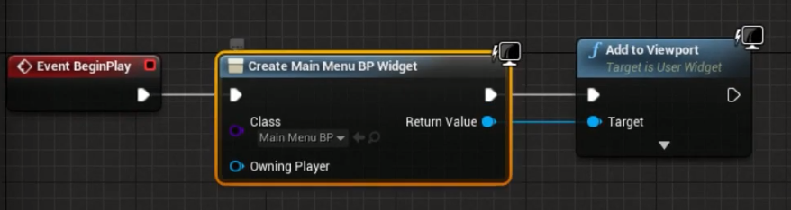

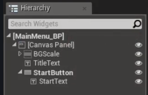

### UI Scale Box, Buttons & Mouse

- MainMenu Level BP
- How to show the Player Mouse
- GetPlayerController
- SetShowMouseCursor


### Controller Ready Navigation

- MainMenu_BP Viewport
	+ Start Button widget
		* Events
			- OnClicked

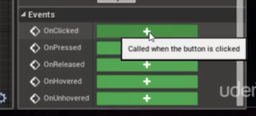

- MainMenu_BP Event Graph
	+ Wire up opening a level
		* OpenLevel node
	+ Focus the Start Button automatically
		* WidgetReady
- MainMenu Level BP
	+ Wire up WidgetReady event at the end of the control graph
- MainMenu_BP Event Graph
	+ create Start Button node
	+ create Get Player Controller node
	+ create Set Input Mode UIOnly node

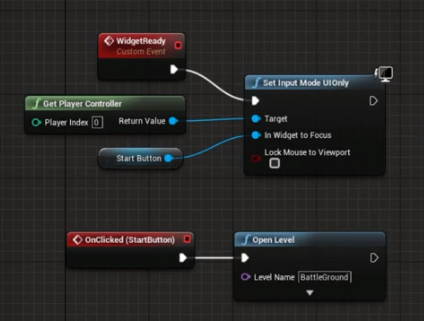

- Create a Game Quit Action
- Project -> Engine Input -> Action Mapping
	+ Game Pad Special Left Button
		* The back button on an XBox controller
- BattleGround Level BP
	+ Wire up Action Quit


### Trial Packaging Your Game

- Project Settings -> Maps and Modes
	+ Game Default Map
	+ Editor Startup Map
- File -> Package Project -> Windows 64 bit
- Problem: Set Input Mode UIOnly
	+ Mode never switches over to Game Only

## Mid-Section Quiz

### Delegating to Components

- Create a Tank C++ Class


- Create a TankPlayerController C++ Class


### Using Virtual and Override

- Backstory: what pawn are we possessing when starting the game?
- Try Logging from a Blueprint


- Take a look at APlayerController and the AActor parent

[APlayerController Unreal Doc](https://docs.unrealengine.com/latest/INT/API/Runtime/Engine/GameFramework/APlayerController/index.html)

- `virtual void BeginPlay()`
- need to override, what is the syntax?
- `void BeginPlay() override;`
- `virtual` ancestors are allowed to override
- in implementation `Super::BeginPlay()`
- Same setup in Tank boilerplate code

### Overloading and Polymorphism

- Polymorphism
	+ Ad-hoc = A different implementation per signature, same signature different implementation
	+ Subtype = Parent pointers pointing at children instances
	+ Parametric = One implementation, multiple signatures
	+ [Blog about cpp polymorphism](http://www.catonmat.net/blog/cpp-polymorphism/)

### Virtual Functions and Vtables

- [Compiler Explorer](https://godbolt.org/)
- [YT video](https://www.youtube.com/watch?v=bSkpMdDe4g4)
- Assembly code and a view for Binary instructions!
- Find out just how many more lines of Assembly virual will take
- Assembly code methods are labels
- Experiment by removing `virtual` + overrides
	+ Observations
	+ code is shorter
	+ `animal.MakeNoise()`
		* right click on the line, scroll to assembly
		* Assembly is actually only one line of code
		* it is actually an address in memory (400cf4)

- virtual
- Vtable lookup the address of MakeNoise function for the type of animal
	+ Animal -> Cat Vtable -> Cat::MakeNoise()
	+ Animal -> Dog Vtable -> Dog::MakeNoise()
	+ If another Cat then share the same Cat Vtable
- insert virtual back into the source code

```cpp
// 2. subtype polymorphism (AKA runtime polymorphism)
class Animal
{
public:
	virtual void MakeNoise()
	{
		std::cout << "???" << std::endl;
	}
};
```

- notice vtable in assembly

```
vtable for Kitteh:
  .quad 0
  .quad typeinfo for Kitteh
  .quad Kitteh::MakeNoise()
```

- more 'hops' involved when using virtual
- cpp mantra "don't pay for what you don't use"

### Creating an AI Controller Class


- Create a TankAIController
- Auto Possess [with] AI

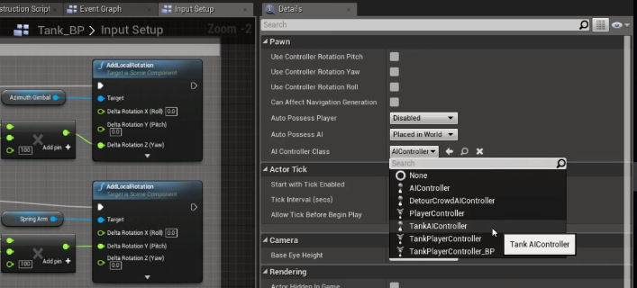

- At Game Start multiple pawns get possessed by TankAIController

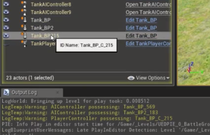

### Get the Player Controller with C++

- AimAt(Player)

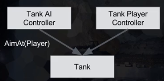

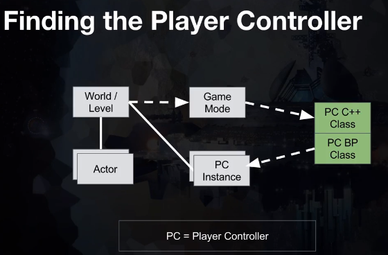

```cpp
ATank* ATankAIController::GetPlayerTank() const
{
	auto PlayerPawn = GetWorld()->GetFirstPlayerController()->GetPawn();
	if (!PlayerPawn){ return PlayerPawn; }
	return Cast<ATank>(PlayerPawn);
}
```


### Add `Tick()` to Player Controller

- AimAt(Crosshair)


```cpp
void ATankPlayerController::AimAtCrosshair()
{
	if (!GetControlledTank()) { return; }

	// Get world location of linetrace through crosshair
	// If it hits the landscape
		// Tell controlled tank to aim at this point
}
```

### Creating an Out Parameter Method

```cpp
// Get world location of linetrace through crosshair, true if hits landscape
bool GetSightRayHitLocation(FVector& OutHitLocation) const
{
	OutHitLocation = FVector(1.0);
	return true;
}
```

### Finding Screen Pixel Coordinates

- **Objective**: Find crosshair location on the screen

```cpp
/// TankPlayerController.h

// location left/right
UPROPERTY(EditAnywhere)
float CrosshairXLocation = 0.5;

// location from top down
UPROPERTY(EditAnywhere)
float CrosshairYLocation = 0.3333;
```

```cpp
/// TankPlayerController.cpp

// Find crosshair location
	int32 ViewportSizeX, ViewportSizeY;
	GetViewportSize(ViewportSizeX, ViewportSizeY);
	auto ScreenLocation = FVector2D(ViewportSizeX * CrosshairXLocation, ViewportSizeY * CrosshairYLocation);
```

### Using `DeprojectScreenToWorld`

- **Objective**: Get world space direction as a unit vector

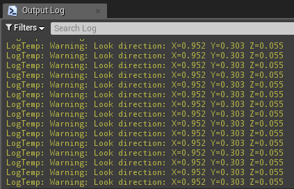

- [DeprojectScreenPositionToWorld Unreal Doc](https://docs.unrealengine.com/latest/INT/API/Runtime/Engine/GameFramework/APlayerController/DeprojectScreenPositionToWorld/index.html)

```cpp
/// TankPlayerController.h

bool GetLookDirection(FVector2D ScreenLocation, FVector& LookDirection) const;
```

```cpp
/// TankPlayerController.cpp

bool ATankPlayerController::GetLookDirection(FVector2D ScreenLocation, FVector & LookDirection) const
{
	FVector CameraWorldLocation; // TODO: discard
	return DeprojectScreenPositionToWorld(
		ScreenLocation.X,
		ScreenLocation.Y,
		CameraWorldLocation,
		LookDirection
	);
}
```

### Using `LineTraceSingleByChannel`

- **Objective**: Get an actual point in the world to aim at
 
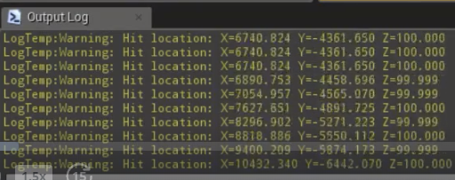

- [LineTraceSingleByChannel Unreal Doc](https://docs.unrealengine.com/latest/INT/API/Runtime/Engine/Engine/UWorld/LineTraceSingleByChannel/index.html)

```cpp
/// TankPlayerController.h

UPROPERTY(EditAnywhere)
float LineTraceRange = 1000000;

bool GetLookVectorHitLocation(FVector LookDirection, FVector& HitLocation) const;
```

```cpp
/// TankPlayerController.cpp

bool ATankPlayerController::GetLookVectorHitLocation(FVector LookDirection, FVector & HitLocation) const
{
	FHitResult HitResult;
	auto StartLocation = PlayerCameraManager->GetCameraLocation();
	auto EndLocation = StartLocation + (LookDirection * LineTraceRange);

	if (GetWorld()->LineTraceSingleByChannel(
		HitResult,
		StartLocation,
		EndLocation,
		ECollisionChannel::ECC_Visibility))
	{
		HitLocation = HitResult.Location;
		return true;
	}
	
	return false;
}
```

### Unify Player and AI Aiming

- **Objective**: Call same `AimAt()` method whether it is a player controller or an AI controller possessing a tank


- Create `AimAt` method on the Tank class

```cpp
/// Tank.h

public:
	void AimAt(FVector HitLocation);
```

```cpp
/// Tank.cpp

void ATank::AimAt(FVector HitLocation)
{
	auto OurTankName = GetName();
	UE_LOG(LogTemp, Warning, TEXT("%s aiming at %s"), *OurTankName, *HitLocation.ToString())
}
```

- Call the method from the player controller

```cpp
/// TankPlayerController.cpp

void ATankPlayerController::AimAtCrosshair()
{
	if (!GetControlledTank()) { return; }

	FVector HitLocation;
	if (GetSightRayHitLocation(HitLocation))
	{
		GetControlledTank()->AimAt(HitLocation);
	}
}
```

- Add a `Tick` method, call same `AimAt` method every frame to aim at the player

```cpp
/// TankAIController.h

private:
	virtual void Tick(float DeltaTime) override;
```

```cpp
/// TankAIController.cpp

void ATankAIController::Tick(float DeltaTime)
{
	Super::Tick(DeltaTime);

	if (GetPlayerTank())
	{
		// Move towards the player
		
		// Aim towards the player
		GetControlledTank()->AimAt(GetPlayerTank()->GetActorLocation());

		// Fire when ready
	}
}
```

- Using the same `AimAt` method is automatically equitable game play, fair, and balanced.


## Mid-Section Quiz

### Creating Default Sub Objects in C++

- **Objective**: Create an Aiming Component in C++ and Delegate aiming to it


***1. Create the Aiming Component Default Subobject and add it to the Tank***

```cpp
/// Tank.h

// Create in UnrealEd and hash include this Actor Component
#include "TankAimingComponent.h"

UCLASS()
class BATTLETANK_API ATank : public APawn
{
	GENERATED_BODY()

public:
	// Aiming code

protected:
	// Cannot make private, would cause compile error and shouldn't be public
	UTankAimingComponent* TankAimingComponent = nullptr;

private:
	// Private code
}
```

```cpp
/// Tank.cpp

ATank::ATank()
{
 	// Tick code

	// Pointer protection not needed since created during construction
	TankAimingComponent = CreateDefaultSubobject<UTankAimingComponent>(FName("AimingComponent"));
}
```

***2. Delegate `AimAt()` to the Aiming Component instead of Tank***

```cpp
/// TankAimingComponent.h

// Macro Boilerplate code
class BATTLETANK_API UTankAimingComponent : public UActorComponent
{
	GENERATED_BODY()

public:	
	// Boilerplate code

	// Tick Component code

	void AimAt(FVector HitLocation);
}

```

```cpp
/// TankAimingComponent.cpp

void UTankAimingComponent::AimAt(FVector HitLocation)
{	
	// `GetOwner()` grab the parent's name, just `GetName()` when implemented in Tank.cpp
	auto OurTankName = GetOwner()->GetName();
	UE_LOG(LogTemp, Warning, TEXT("%s aiming at %s"), *OurTankName, *HitLocation.ToString())
}
```

***3. Call the method on the `TankAimingComponent`***

```cpp
/// Tank.cpp

// Much simpler `AimAt` method delegated to the component
void ATank::AimAt(FVector HitLocation)
{
	TankAimingComponent->AimAt(HitLocation);
}
```

### `BlueprintCallable()`

- **Objective**: Find start and end location of the projectile


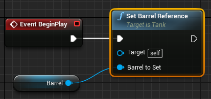

***1. Declare `SetBarrelReferenced`***

```cpp
/// TankAimingComponent.h

#include "Components/StaticMeshComponent.h"

/// Macro here
class BATTLETANK_API UTankAimingComponent : public UActorComponent
{
	/// Boilerplate here

public:	
	/// Other methods here

	// Method for setting the barrel reference
	void SetBarrelReference(UStaticMeshComponent * BarrelToSet);
protected:
	// protected code
private:
	// initialize default barrel pointer
	UStaticMeshComponent * Barrel = nullptr;
}
```

***2. Implement `SetBarrelReference`***

```cpp
/// TankAimingComponent.cpp

// implementation for setting the barrel reference
void UTankAimingComponent::SetBarrelReference(UStaticMeshComponent * BarrelToSet)
{
	Barrel = BarrelToSet;
}
```

- Make it possible to call C++ function from Blueprint

```cpp
/// Tank.h

/// Macro here
class BATTLETANK_API ATank : public APawn
{
	/// Boilerplate here
public:
	// Create a BlueprintCallable method
	UFUNCTION(BlueprintCallable, category=Setup)
	void SetBarrelReference(UStaticMeshComponent * BarrelToSet);
protected:
	// protected code
private:
	// private code
}
```

```cpp
/// Tank.cpp

// Delegate out setting the barrel reference
void ATank::SetBarrelReference(UStaticMeshComponent * BarrelToSet)
{
	TankAimingComponent->SetBarrelReference(BarrelToSet);
}
```

***3. Logging out the Barrel Component Location***

```cpp
/// TankAimingComponent.cpp

void UTankAimingComponent::AimAt(FVector HitLocation)
{
	auto OurTankName = GetOwner()->GetName();
	// Now we can get the barrel component location
	auto BarrelLocation = Barrel->GetComponentLocation();
	UE_LOG(LogTemp, Warning, TEXT("%s aiming at %s from %s"), *OurTankName, *HitLocation.ToString(), *BarrelLocation.ToString())
}
```

### `SuggestProjectileVelocity()`

- **Objective**: Understand launch velocity


[Wikipedia Projectile Motion](https://en.wikipedia.org/wiki/Projectile_motion)


[SuggestProjectileVelocity Learn Doc](https://docs.unrealengine.com/latest/INT/BlueprintAPI/Game/Components/ProjectileMovement/SuggestProjectileVelocity/index.html)

[SuggestProjectileVelocity C++ Doc](https://docs.unrealengine.com/latest/INT/API/Runtime/Engine/Kismet/UGameplayStatics/SuggestProjectileVelocity/index.html)

***1. Setup a `LaunchSpeed` parameter***

```cpp
/// Tank.h

/// Macros here
class BATTLETANK_API ATank : public APawn
{
	/// Boilerplate
public:
	// Tank doesn't care about `LaunchSpeed` or other aiming parameters
	void AimAt(FVector HitLocation);
	// More code
protected:
	// Protected code
private:
	// Create a new property that will show up in a new
	// Firing category on the Blueprint which will 
	// allow us to experiment with different launch speeds
	UPROPERTY(EditAnywhere, category=Firing)
	float LaunchSpeed = 100000; // 1000 m/s
};

```

***2. Pass the `LaunchSpeed` to `TankAimingComponent` `AimAt()`***

```cpp
/// Tank.cpp

void ATank::AimAt(FVector HitLocation)
{
	TankAimingComponent->AimAt(HitLocation, LaunchSpeed);
}
```

***3. Add the new parameter to the aiming component***

```cpp
/// TankAimingComponent.h

/// Macro here
class BATTLETANK_API UTankAimingComponent : public UActorComponent
{
	/// Boilerplate here
public:	
	void AimAt(FVector HitLocation, float LaunchSpeed);
protected:
	// protected code
private:
	// private code
}
```

***4. Log out the `LaunchSpeed` parameter's value***

```cpp
/// TankAimingComponent.cpp

void UTankAimingComponent::AimAt(FVector HitLocation, float LaunchSpeed)
{
	UE_LOG(LogTemp, Warning, TEXT("Firing at %.2f cm/s"), LaunchSpeed)
}
```

### Predict Projectile Landing Point

- **Objective**: Get the `AimDirection`: where we should be aiming our barrel

```cpp
/// TankAimingComponent.cpp

#include "Kismet/GameplayStatics.h"
#include "Kismet/GameplayStaticsTypes.h"

void UTankAimingComponent::AimAt(FVector HitLocation, float LaunchSpeed)
{
	// protect pointers
	if (!Barrel) { return; }

	// Out parameter, in engine code all are prefixed "Out"
	FVector OutLaunchVelocity;
	// Create a socket in Unreal on the barrel first
	// The start location is the projectile location
	FVector StartLocation = Barrel->GetSocketLocation(FName("Projectile"));

	// https://docs.unrealengine.com/latest/INT/API/Runtime/Engine/Kismet/UGameplayStatics/SuggestProjectileVelocity/index.html
	if (UGameplayStatics::SuggestProjectileVelocity(
				this,
				OutLaunchVelocity,
				StartLocation,
				HitLocation,
				LaunchSpeed,
				false,
				0.0,
				0.0,
				ESuggestProjVelocityTraceOption::DoNotTrace	
			)
		)
	{
		// Direction of the Vector provided
		// Getting the "Unit Vector"
		auto AimDirection = OutLaunchVelocity.GetSafeNormal();
		auto TankName = GetOwner()->GetName();
		UE_LOG(LogTemp, Warning, TEXT("%s aiming at %s"), *TankName, *AimDirection.ToString())
	}
	// do nothing if unsuccessful
}
```

### Using `FRotators` in Unreal

- **Objective**: Control the Roll, Pitch, and Yaw of barrel

***NOTE***: A vector that points equally down the X and Y axis is "Yawed" by 45 degrees clockwise as seen from above. Note Roll may be null as we have said nothing about Roll so it can't be inferred (we're pointing the arrow not rotating it when we create the FVector)

***1. Create a Barrel Class***

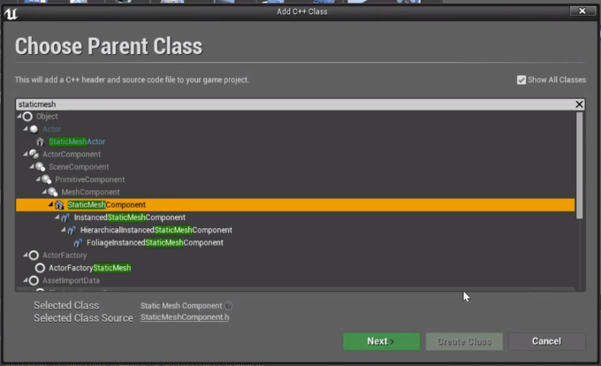


***2. Create the `MoveBarrelTowards` method***

***3. Work out what `MoveBarrelTowards` needs to do***

**The pseudo-code** 

- Get the difference between the current barrel rotation and `AimDirection`
- Move the barrel the correct amount this frame
- Given a max elevation speed, and the frame time

```cpp
/// TankAimingComponent.h
// Macro here
class BATTLETANK_API UTankAimingComponent : public UActorComponent
{
	// Boilerplate
public:	
	// public code
private:
	void MoveBarrelTowards(FVector AimDirection);
};
```

```cpp
/// TankAimingComponent.cpp

void UTankAimingComponent::AimAt(FVector HitLocation, float LaunchSpeed)
{
	// Code to get projectile velocity here
	// Get the result as `bHaveAimSolution`

	// Call `MoveBarrelTowards()` where we used to log out information
	if (bHaveAimSolution) {
		auto AimDirection = OutLaunchVelocity.GetSafeNormal();
		MoveBarrelTowards(AimDirection);
	}
}

void UTankAimingComponent::MoveBarrelTowards(FVector AimDirection)
{
	auto BarrelRotator = Barrel->GetForwardVector().Rotation();
	auto AimAsRotator = AimDirection.Rotation();
	auto DeltaRotator = AimAsRotator - BarrelRotator;
	Barrel->Elevate(5);
}
```

***4. It is at this time that we need to search/replace in Tank (h and cpp) and TankAimingComponent (h and cpp) `UStaticMeshComponent * Barrel` with `UTankBarrel * Barrel` and `UStaticMeshComponent * BarrelToSet` with `UTankBarrel * BarrelToSet`***

***5. Hash include `TankBarrel.h` in `TankAimingComponent.cpp` is not necessary because we are calling a method on the `TankBarrel` class***

### The C++ Compilation Process

- **Objective**: Understand the best way to import header files

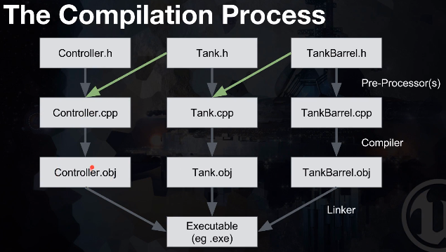

### Using Forward Declarations

- **Objective**: Create Barrel Class and Barrel `Elevate` method

***1. Create Forward Declarations in h files***

```cpp
/// Tank.h

// Forward Declaration, enable referencing of the type in class decaration
class UTankBarrel;
```

```cpp
/// TankAimingComponent.h

// Forward Declaration, enable referencing of the type in class decaration
class UTankBarrel;
```

***2. Update the cpp files' hash includes if necessary***

```cpp
/// Tank.cpp

// No methods called on `TankBarrel`, no need to hash include `TankBarrel.h`
#include "Tank.h"
```

```cpp
/// TankAimingComponent.cpp

// `MoveBarrelTowards()` calls `TankBarrel` `Elevate` method, need to hash include `TankBarrel.h` in the cpp file
#include "TankBarrel.h"
```

### `BlueprintSpawnableComponent()`

- **Objective**: Replace the `UStaticMeshComponent` class with `TankBarrel` C++ class as input to the `Set Barrel Reference` Unreal Function in the Event Graph for Tank_BP and add some setup Unreal Properties to the `TankBarrel`

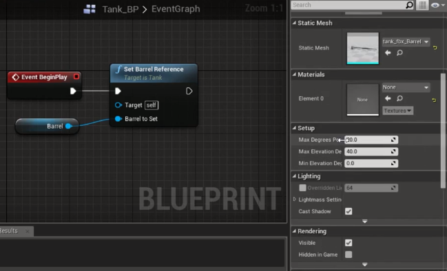


***1. Make TankBarrel show up in Unreal's Add Component menu by adding `BlueprintSpawnableComponent` to the class declaration***

```cpp
/// TankBarrel.h

UCLASS(meta = (BlueprintSpawnableComponent))
class BATTLETANK_API UTankBarrel : public UStaticMeshComponent
{
	// Class declaration code
}
```


***2. Replace the StaticMeshComponent Barrel with the new TankBarrel component and drag that component to the Event Graph***

***3. Hook up the new Barrel to the Unreal Function Input***

***4. Re-assign Static Mesh of the Barrel***

***5. Verify new Setup properties exist on the new Barrel***

```cpp
/// TankBarrel.h

// Sometimes useful to hide categories in UEd from designers for instance "Collision"
UCLASS(meta = (BlueprintSpawnableComponent), hidecategories = ("Collision"))
```

### Review Our Execution Flow

- **Objective**: Zoom out of the details and examine the Call Stack


***1. `DegreesPerSecond` is wrong, change `Elevate(float DegreesPerSecond)` to `Elevate(float RelativeSpeed)`***

***2. `RelativeSpeed` is +-1 max speed***


***3. Player/AI Controller need a tick, as well as Tank Aiming Component***

***4. Tank Does not need a tick to get rid of it in Tank h and cpp files***

***5. Print the time to verify method is called every tick***

```cpp
/// TankBarrel.cpp

void UTankBarrel::Elevate(float RelativeSpeed)
{
	auto Time = GetWorld()->GetTimeSeconds();
	UE_LOG(LogTemp, Warning, TEXT("%.2f: Rotate at speed: %f"), Time, RelativeSpeed)
}
```

***6. Verify: Does the `TankAimingComponent` really need to tick?***

***7. Figure out: Aiming logs stop intermittently, could it be the Aiming Solution? Change the logs to figure out why.***

### How to Report Bugs

- **Objective**: Fix the Aim Solution bug, report it to Unreal
	+ [Unreal Answer Hub](https://answers.unrealengine.com/index.html)

***1. Solution: Default parameters not being specified in `SuggestProjectileVelocity`***

***2. Problem is in 4.11 and 4.12***

***3. To report, comment and upload code to GitHub and share the commit link with Unreal***

```cpp
/// TankAimingComponent.cpp

bool bHaveAimSolution = UGameplayStatics::SuggestProjectileVelocity(
		this,
		OutLaunchVelocity,
		StartLocation,
		HitLocation,
		LaunchSpeed,
		false, // <--
		0,     // <--
		0,     // <--
		ESuggestProjVelocityTraceOption::DoNotTrace	
);
```

- **Second Objective**: Move to Forward Delarations in all .h files

***1. `#includes Tank.h` in multiple h files, declare `class ATank;` in each header and hash include `Tank.h` in each cpp file***

## Mid-Section Quiz

### Using `Clamp()` to Limit Values

- **Objective**: Rotate the TankBarrel but clamp rotations to a maximum value

- If values are plugged in manually for `SetRelativeRotation()` then the problem we need to solve is visible by playing the game. The barrel rotates beyond the maximum elevation and does not stop rotating at around 8 seconds (calculation based on `MaxDegreesPerSecond`)


- Use the `FMath` struct's `Clamp` function to clamp the elevate speed to +/-1
- Calculate the `ElevationChange` using `GetWorld()->DeltaTimeSeconds` to get current time in seconds
- Also `Clamp` the degree of elevation to the values set in the blueprint 0 -> 40


- Test it works, play game, deposess the tank and inspect it's details

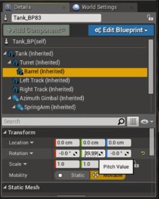

### CHALLENGE - Turret Rotation

- **Objective**: Make the turret rotate

- To get started, what we would like to see in the UI is the Turret class along side the Barrel Class. Then we need to make a `BlueprintCallable` function we can use in the Event Graph.

***1. Create the TankTurret C++ Class***


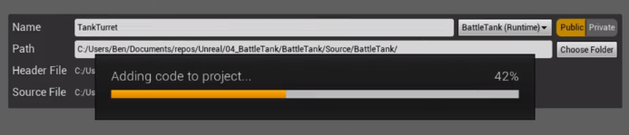

***2. Add the `UCLASS(meta = (BlueprintSpawnableComponent))` macro***

```cpp
/// TankTurret.h

// Add `BlueprintSpawnableComponent` macro
UCLASS(meta = (BlueprintSpawnableComponent))
class BATTLETANK_API UTankTurret : public UStaticMeshComponent
{ //Class declaration
}
```

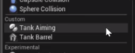

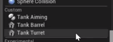

***3. Create `SetTurretReference` `BlueprintCallable` function in `Tank.h` and create the implementation***

***4. Create forward declaration of `UTankTurret` in `Tank.h`***

```cpp
/// Tank.h

// Forward declaration
class UTankTurret;

/// Macro here
class BATTLETANK_API ATank : public APawn
{
	// Boilerplate code here

public:
	// Add `BlueprintCallable` function
	UFUNCTION(BlueprintCallable, category = Setup)
		void SetTurretReference(UTankTurret * TurretToSet);

	// Class declaration continued...
}
```

```cpp
/// Tank.cpp

// Deleget `SetTurretReference` to the `TankAimingComponent`
void ATank::SetTurretReference(UTankTurret * TurretToSet)
{
	TankAimingComponent->SetTurretReference(TurretToSet);
}
```

***5. `TankAimingComponent.h` create a `void SetTurretReference(UTankTurret * TurretToSet);`***

***6. `TankAimingComponent.h` create a `UTankTurret * Turret = nullptr;`***

***7. `TankAimingComponent.h` forward declaration `class UTankTurret;`***


```cpp
/// TankAimingComponent.h

// Forward declaration
class UTankTurret;


/// Macro here
class BATTLETANK_API UTankAimingComponent : public UActorComponent
{
	// Boilerplate code here

public:
	// Delegated `SetTurretReference`
	void SetTurretReference(UTankTurret * TurretToSet);
	// More code here
private:
	UTankTurret* Turret = nullptr;
	// Class declaration continued...
}
```

***8. `TankAimingComponent.cpp` create a `void UTankAimingComponent::SetTurretReference(UTankTurret * TurretToSet)`***

***9. `TankAimingComponent.cpp` hash include `#include "TankTurret.h"`***

```cpp
/// TankAimingComponent.cpp

// Forward declarations require us to hash include the header
#include "TankTurret.h"


void UTankAimingComponent::SetTurretReference(UTankTurret * TurretToSet)
{
	if (!TurretToSet) { return; }
	Turret = TurretToSet;
}
```

- Now we are able to create the function in `Tank_BP`


### CHALLENGE - Turret Rotation Pt 2

- **Objective**: Get fully operational and game play tested Rotation

***1. Create `Rotation` method***

***2. Create the MaxDegreesPerSecond Property***

```cpp
/// TankTurret.h

//Macro here
class BATTLETANK_API UTankTurret : public UStaticMeshComponent
{
	// Boilerplate here
public:
	void Rotate(float RelativeSpeed);

private:
	UPROPERTY(EditDefaultsOnly, Category = Setup)
	float MaxDegreesPerSecond = 25;
}
```

```cpp
/// TankTurret.cpp

void UTankTurret::Rotate(float RelativeSpeed)
{
	auto RelativeSpeedClamped = FMath::Clamp<float>(RelativeSpeed, -1., 1.);
	auto RotationChange = RelativeSpeedClamped * MaxDegreesPerSecond * GetWorld()->DeltaTimeSeconds;
	auto Rotation = RelativeRotation.Yaw + RotationChange;
	SetRelativeRotation(FRotator(0, Rotation, 0));
}
```


***3. To get the Turret, the control stack will be similar to Aiming***

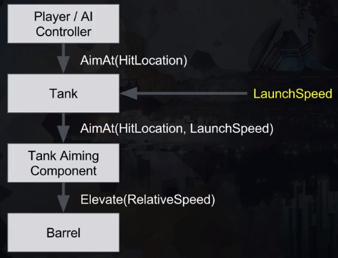

```cpp
/// TankAimingComponent.cpp

void UTankAimingComponent::MoveBarrelTowards(FVector AimDirection)
{
	// Aiming code here

	// Finally call Rotate
	Turret->Rotate(DeltaRotator.Yaw);
}
```

***4. Test some values in Blueprint for Elevation and Rotation values then push the values into C++ so that if designer creates more tanks the default values will all be the same.***

***5. Address the TODO find out if Aiming Component needs to tick optimization. In the video, it is not necessary but in my case it IS necessary***

### Setting Up Projectiles

- **Objective**: Move beyond the Tank and focus on firing


***1. Set up Firing control setting in Project Settings***


***2. Create Fire BlueprintCallable method in C++***

```cpp
/// Tank.h

/// Macro here
class BATTLETANK_API ATank : public APawn
{
	// Boilerplate code here
public:
	// Add `BlueprintCallable` function
	UFUNCTION(BlueprintCallable, category = Firing)
	void Fire();
}
```

```cpp
/// Tank.cpp

void ATank::Fire()
{
	// Log out which Tank is firing
	UE_LOG(LogTemp, Warning, TEXT("%s Firing"), *this->GetName())
}
```

***3. Edit the Input Binding Setup in Tank_BP***


- **Next Achievement**: Create a projectile and fire it

***1. Projectile deserves its own C++ class because it will have many attributes***

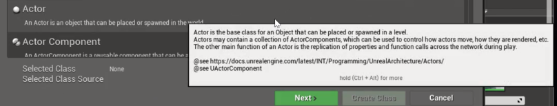


***2. Create a Projectile_BP from C++ Class***

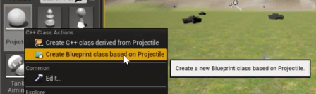

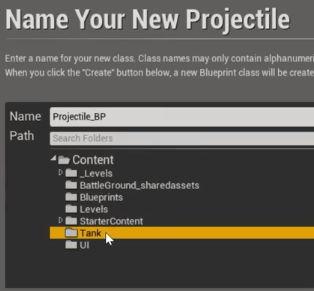

### Upgrading to Unreal 4.2

- **Objective**: Install 4.2, Test Game

### Working Around Awkward Bugs

- **Objective**: Stop an annoying bug that manifests after upgrading engine version

### Using `SpawnActor<>()` to Spawn

- **Objective**: Spawn projectiles at the end of the barrel

- [TSubclassOf docs](https://docs.unrealengine.com/latest/INT/Programming/UnrealArchitecture/TSubclassOf/)

- Before getting started add a Sphere with a scale of 1 to the Projectile_BP, Save All

- First Achievement: Instantiate Projectile from code

***1. Create A `BlueprintCallable` Property on the Tank class that we can set the Projectile with, remember forward delaration of `AProjectile`***

```cpp
/// Tank.h

// Forward declarations
// more declarations here
class AProjectile;

/// Macro here
class BATTLETANK_API ATank : public APawn
{
	// Boilerplate code here
public:
	// public code here
protected:
	// protected code here
private:
	// Set the `BlueprintCallable` property for the projectile
	UPROPERTY(EditDefaultsOnly, category = Setup)
	TSubclassOf<AProjectile> ProjectileBlueprint;
}
```


***2. Declare a reference to the barrel in the Tank class for spawning a projectile off of `UTankBarrel* Barrel = nullptr;`***

***3. Create socket location on the Barrel called "Projectile"***

***4. Spawn actor in the `ATank::Fire()` method***

```cpp
/// Tank.cpp

#include "Projectile.h"


void ATank::Fire()
{	
	// ...

	// Spawn a projectile at the socket on the barrel
	auto Projectile = GetWorld()->SpawnActor<AProjectile>(
		ProjectileBlueprint,
		Barrel->GetSocketLocation(FName("Projectile")),
		Barrel->GetSocketRotation(FName("Projectile"))
	);

	// ...
}
```

- **Achievement Unlocked!**


### Projectile Moving Components

- **Objective**: Add a Movement Component to the projectile much the same way we added Aiming Component to the Tank

***1. Add Projectile Movement Component, first what is it called?***


***2. set `bAutoActivate` to false***

```cpp
/// Projectile.h

#include "GameFramework/ProjectileMovementComponent.h"

// Macro here
class BATTLETANK_API AProjectile : public AActor
{
	// Boilerplate code
	
public:	
	// public code here

protected:
	// protected code here
private:
	// Declare the Movement Component
	UProjectileMovementComponent * ProjectileMovementComponent = nullptr;
};
```

```cpp
/// Projectile.cpp

#include "Projectile.h"

// Sets default values
AProjectile::AProjectile()
{
 	// Set this actor to call Tick() every frame.  You can turn this off to improve performance if you don't need it.
	PrimaryActorTick.bCanEverTick = true;

	ProjectileMovementComponent = CreateDefaultSubobject<UProjectileMovementComponent>(FName("MovementComponent"));
	ProjectileMovementComponent->bAutoActivate = false;
	
}
```

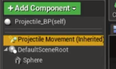

***3. Create the lauch projectile method and call it in `Tank.cpp`***

```cpp
/// Projectile.h

#include "GameFramework/ProjectileMovementComponent.h"

// Macro here
class BATTLETANK_API AProjectile : public AActor
{
	// Boilerplate code
public:	
	// Launch projectile method
	void LaunchProjectile(float Speed);

// Class delaration continued...
};
```

```cpp
void AProjectile::LaunchProjectile(float Speed)
{
	auto TankName = GetOwner()->GetName();
	UE_LOG(LogTemp, Warning, TEXT("%s Firing at speed %f"), *TankName, Speed)
}
```

```cpp
/// Tank.cpp

void ATank::Fire()
{	
	// ...

	// Spawn a projectile at the socket on the barrel

	// Fire the projectile
	Projectile->LaunchProjectile(LaunchSpeed);

	// ...
}

```

***4. Actually launch the projectile***

***5. Since `ProjectileMovementComponent->bAutoActivate = false;` we need to set the velocity then call `Activate()`***

```cpp

void AProjectile::LaunchProjectile(float Speed)
{
	// Log firing

	// Launch
	ProjectileMovementComponent->SetVelocityInLocalSpace(FVector::ForwardVector * Speed);
	ProjectileMovementComponent->Activate();
}
```

### Making AI Tanks Fire

- **Objective**: Limit firing rate, make the Tank AI fire at the Player Tank


***1. Defactor or Inline refactored code and remove logging code in BeginPlay***

- Start off firing every tick in `UTankAimingComponent::AimAt`

```cpp
/// TankAIController.cpp

void ATankAIController::Tick(float DeltaTime)
{
	Super::Tick(DeltaTime);

	// Inlining what was previously 2 methods
	auto ControlledTank = Cast<ATank>(GetPawn());
	auto PlayerTank = Cast<ATank>(GetWorld()->GetFirstPlayerController()->GetPawn());

	if (PlayerTank)
	{
		// Move towards the player
		
		// Aim towards the player
		ControlledTank->AimAt(PlayerTank->GetActorLocation());

		// TODO: limit firing rate
		ControlledTank->Fire();
	}
}
```

***2. Limit the firing rate by declaring `ReloadTimeInSeconds` on the Tank and make it a `UPROPERTY` (in the videos this doesn't happen until next lecture)***

```cpp
/// Tank.h

// Forward declarations
// more declarations here
class AProjectile;

/// Macro here
class BATTLETANK_API ATank : public APawn
{
	// Boilerplate code here
public:
	// public code here
protected:
	// protected code here
private:
	// declare ReloadTimeInSeconds
	UPROPERTY(EditDefaultsOnly, category = Firing)
	float ReloadTimeInSeconds = 3;
// Class declaration continued...
}
```

***3. Create a timer and only fire when the timer expires***

```cpp
/// Tank.h
/// Macro here
class BATTLETANK_API ATank : public APawn
{
	// ...
private:
	// ...
	double LastFireTime = 0;
	// ...
}
```

```cpp
/// Tank.cpp

void ATank::Fire()
{	
	bool isReloaded = (FPlatformTime::Seconds() - LastFireTime) > ReloadTimeInSeconds;

	if (Barrel && isReloaded)
	{
		// Spawn a projectile at the socket on the barrel

		// Fire the projectile

		// Reset timer
		LastFireTime = FPlatformTime::Seconds();
	}
	// ...
}
```


### `EditAnywhere` vs `EditDefaultsOnly`


- **Objective**: Start using EditDefaultsOnly and examine the effects

- *Note from previous*: `FPlatformTime::Seconds()` is time that begins some time in the past

- EditAnywhere: Editable on any tank instance

- EditDefaultsOnly: Editable only on the Tank_BP
	+ most sensible choice for all game properties created up until this point


## Mid-Section Quiz

### Adding a Quit Button

- **Objective**: Fix an issue with collisions, add a Quit Button in the UI

- Remove collision objects on the tracks and add a new simplified collision object
- Adjust its collision offset in Blueprint Details


***1. Create a Quit Button by copy/pasting in the UI Outliner and change the text***

***2. Create an OnReleased Event on the Button***

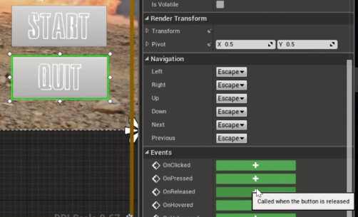

***3. Wire Event to QuitGame***


### Setup Track Throttles

- **Objective**: Log out Track Throttle values to the console

***1. Base Tracks on C++ Class***

- Create A TankTrack Class
- Inherit from UStaticMeshComponent
- BluePrintSpawnableComponent as barrel/turret
- Replace tracks on Tank blueprint
- Test

***2. Create a new Axis Mapping in Input Bindings for the project for Left and Right Track Throttle***


***3. Create `SetThrottle` `BlueprintCallable` functions***

```cpp
/// TankTrack.h

// Macro here
class BATTLETANK_API UTankTrack : public UStaticMeshComponent
{
	// Boilerplate here
public:
	UFUNCTION(BlueprintCallable, Category = Input)
	void SetThrottle(float Throttle);
}
```

```cpp
/// TankTrack.cpp

void UTankTrack::SetThrottle(float Throttle)
{
	auto Name = GetName();
	UE_LOG(LogTemp, Warning, TEXT("%s throttle: %.2f"), *Name, Throttle)
}
```

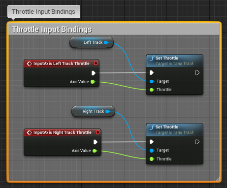

### `ApplyForceAtLocation()` in Action

- **Objective**: Get Tank moving under our control

***1. Input Mapping: Keyboard "A" - left throttle "D" - right throttle***

***2. "Max Driving Force" variable, per track in Newtons***

- F = m * a
- [Wolfram Alpha Acceleration](http://www.wolframalpha.com/input/?i=0-16mph+in+10+secs)
- Guess an initial force assuming no friction
- Getting within a factor of 10 of guess is OK
- 40k kilos at 10ms^-2 (1G acceleration) = 400k Newtons

```cpp
/// TankTrack.h
// Macro here
class BATTLETANK_API UTankTrack : public UStaticMeshComponent
{
	// Boilerplate here
	
public:
	// Throttle setup here

	// Max force per track in Newtons
	UPROPERTY(EditDefaultsOnly) // this is editable on the blueprint only
	float TrackMaxDrivingForce = 400000; // 400k Newtons, 1g Acceleration
};
```

***3. Get the forward vector of the track * Throttle * Max Driving Force***

***4. Get the force location (where force will be applied) by getting the component location***

***5. To get the `TankRoot`: from `GetOwner()->GetRootComponent` we get a `USceneComponent` which needs to be cast into a `UPrimitiveComponent` (inherited from `USceneComponent`) which has an `AddForceAtLocation` method***

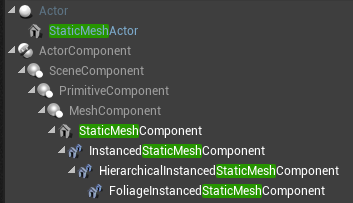

```cpp
/// TankTrack.cpp

void UTankTrack::SetThrottle(float Throttle)
{
	auto Name = GetName();
	UE_LOG(LogTemp, Warning, TEXT("%s throttle: %.2f"), *Name, Throttle)

	// TODO: clamp throttle value
	auto ForceApplied = GetForwardVector() * Throttle * TrackMaxDrivingForce;
	auto ForceLocation = GetComponentLocation();
	auto TankRoot = Cast<UPrimitiveComponent>(GetOwner()->GetRootComponent());
	TankRoot->AddForceAtLocation(ForceApplied, ForceLocation);
}
```

### Physics Materials and Friction

- **Objective**: Adjust the friction attributes to allow the Tank to move

***1. Edit the Tank Body Collision providing ground and track clearance, also make sure collider objects exist on the tank tracks***


**Note:** If collisions between tracks and ground do not work, check Unreal version and `AutoWeld` collision object settings

***2. Create a physics material***

- How friction contributions get combined and calculated


- Override the Friction Combine Mode and set amount to be 0.2 *which means friction = 0.2x the contact force*

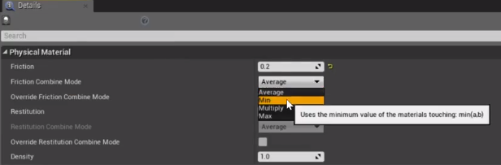

- Select the new Physics Material in Tank_BP Collision Settings for each Track

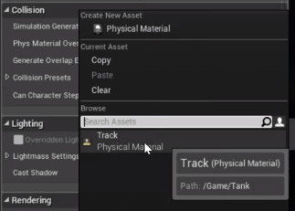

***3. Increase the force by which the tank moves or Power, this demo is using pushing power, other physics constraints can use pushing power (using hidden wheels) which pose different set of problems***

- In the demo, 400k Newtons is used or 40mil cm of force

***4. My Keyboard Input Settings for forward and reverse movement***

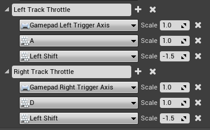

### Fly-By-Wire Control Systems

- **Objective**: Give the Tank control by intention, enabling Human or AI control. End result will be a manual control system along side a fly-by-wire system using Movement Component


- Choosing the Class that gets the job done without too much added complexity

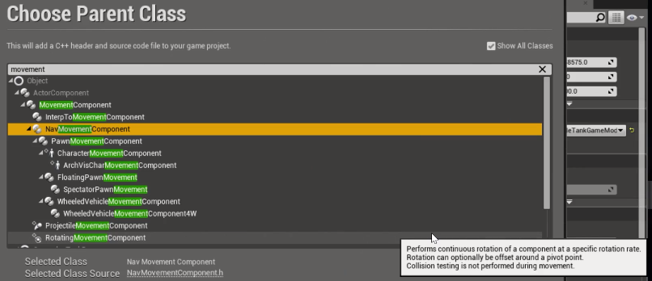

***1. Create TankMovementComponent***


### Using BluePrintReadOnly

- **Objective**: Setup the movement component to be a read-only component capable of being drag & dropped into the event graph

**NOTE: Unreal seems finicky when compiling this component, save often, use source control to your advantage, and shut down and restart Unreal if need be.**

[`BlueprintReadOnly` Unreal Docs](https://wiki.unrealengine.com/Blueprints,_Creating_Variables_in_C%2B%2B_For_Use_In_BP#BlueprintReadOnly)

```cpp
/// TankMovementComponent.h

UCLASS()
class BATTLETANK_API UTankMovementComponent : public UNavMovementComponent
{
	GENERATED_BODY()
	
public:
	UFUNCTION(BlueprintCallable, Category = Input)
	void IntendMoveForward(float Throw);
	
};
```

```cpp
/// TankMovementComponent.cpp

#include "TankMovementComponent.h"

void UTankMovementComponent::IntendMoveForward(float Throw)
{
	UE_LOG(LogTemp, Warning, TEXT("Intend move forward throw: %s"), Throw)
}
```

### A Better Component Architecture

- **Objective**: Revise movement of the tank

**NOTE: This method removes previous instability in Unreal after the movement component had been added**

- Current Component Architecture: Get rid of cyclical passing of references from component back to tank


***1. Get references to tracks in the movement component***

```cpp
/// TankMovementComponent.h

// Forward Declarations
class UTankTrack;

/**
 * Takes input axis values and uses them to move the tank
 */
UCLASS()
class BATTLETANK_API UTankMovementComponent : public UNavMovementComponent
{
	GENERATED_BODY()
	
public:
	// Need to wire this up in Blueprint when the component is added
	UFUNCTION(BlueprintCallable, Category = Setup)
	void Initialize(UTankTrack* LeftTrackToSet, UTankTrack* RightTrackToSet);

	// public declarations cont...
private:
	UTankTrack * LeftTrack = nullptr;
	UTankTrack * RightTrack = nullptr;
};
```

***2. Create an initialize method to wire up the tank tracks in blueprint***

```cpp
/// TankMovementComponent.cpp

void UTankMovementComponent::Initialize(UTankTrack* LeftTrackToSet, UTankTrack* RightTrackToSet)
{
	if (!LeftTrackToSet || !RightTrackToSet) { return; }
	LeftTrack = LeftTrackToSet;
	RightTrack = RightTrackToSet;
}
```

***3. Make `TankMovementComponent` Blueprint Spawnable***

`ClassGroup=(Custom), meta=(BlueprintSpawnableComponent)`

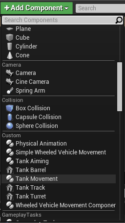

***4. Remove the default subobject assignment in `Tank.cpp`***

`TankMovementComponent = CreateDefaultSubobject<UTankMovementComponent>(FName("MovementComponent"));`


***5. Add the new component to the tank and replace the old component that was created in C++ from the input setup graph.***

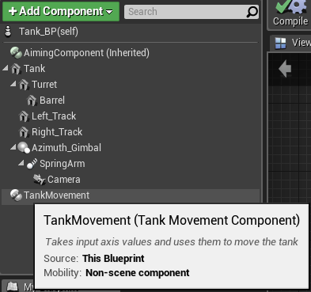

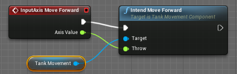

***6. Create new event after Set Turret Reference for Initialize in the Event Graph***


***7. Add instances of left and right track as inputs to the Initialize event in the Event Graph***


***8. Finally, set the throttles on each of the tank tracks in the `IntendMoveForward` method.***

```cpp
/// TankMovementComponent.cpp

#include "TankTrack.h"
// hash includes...

// Initialize method...

// Edited to call `SetThrottle` on each of the tracks
void UTankMovementComponent::IntendMoveForward(float Throw)
{
	// Log information...

	// Set here
	LeftTrack->SetThrottle(Throw);
	RightTrack->SetThrottle(Throw);
}
```

### Completing Manual Tank Movement

- **Objective**: Turning inputs

***1. Create an `IntendTurnRight` `BlueprintCallable` method for `UTankMovementComponent`***

```cpp
/// TankMovementComponent.h
// ...hash includes

UCLASS()
class BATTLETANK_API UTankMovementComponent : public UNavMovementComponent
{
	GENERATED_BODY()
	
public:
	UFUNCTION(BlueprintCallable, Category = Input)
	void IntendTurnRight(float Throw);

// ...class declaration cont
}
```

```cpp
/// TankMovementComponent.cpp

void UTankMovementComponent::IntendTurnRight(float Throw)
{
	LeftTrack->SetThrottle(Throw);
	RightTrack->SetThrottle(-Throw);
}

```

***2. Create a new turn right input binding in project settings***

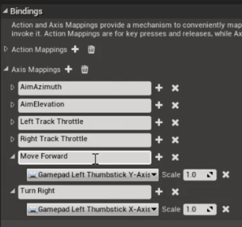

***3. Wire up Turn Right Event in Input Setup***

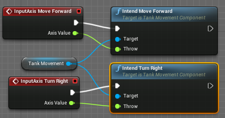

### Introducing AI Pathfinding

- **Objective**: Introduce pathfinding

[Nav Mesh Volume Reference](https://docs.unrealengine.com/latest//INT/Engine/Actors/Volumes/index.html#volumetypes)

***1. Show Nav meshes in viewport***

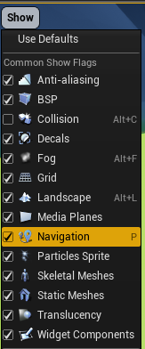

***2. Create a 100m square `NavMeshBoundsVolume`***


***3. Discuss how we are using pathfinding***

- Tank AI Controller `MoveToActor()`


- Nav Movement Component `RequestDirectMove()`


- TODO: Intercept `RequestDirectMove` and use it to move AI tanks

- Pathfinding Logic

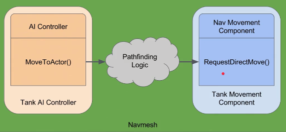

- `RequestDirectMove()` is a Vector of the next navigation point in the navigation volume

### Dissecting `RequestDirectMove()`

- **Objective**: Implement and Log out AI pathfinding information

***1. Add the MoveToActor call inside the `ATankAIController` class***

```cpp
/// TankAIController.h

UCLASS()
class BATTLETANK_API ATankAIController : public AAIController
{
	GENERATED_BODY()

private:
	// class declaration...

	// proximity the AI tank should achieve when moving towards player
	float AcceptanceRadius = 3000; // todo check cm

// class declaration cont...
};
```

```cpp
/// TankAIController.cpp

void ATankAIController::Tick(float DeltaTime)
{
	// tick code...

	// Start moving toward the Player Tank
	if (PlayerTank)
	{
		// Move towards the player
		MoveToActor(PlayerTank, AcceptanceRadius);
	}
}
```

***2. Find `RequestDirectMove()` Signature in the Game Engine code: Engine > UE4 > Source > Runtime > Engine > Classes > GameFrameWork***

***3. Copy the signature***

***4. Override in the TankMovementComponent.h, (hint: use `override`)***

***5. No need to call Super since we're replacing***

```cpp
/// TankMovementComponent.h

// Macro here...
class BATTLETANK_API UTankMovementComponent : public UNavMovementComponent
{
	// Boilerplate here
	
public:
	// Public declarations here

	virtual void RequestDirectMove(const FVector& MoveVelocity, bool bForceMaxSpeed) override;
	
// Class declaration cont...
};
```

***6. Log the tank name and value of `MoveVelocity`***

## Mid-Section Quiz

> **Question 4:**
> If two surfaces have friction coefficients of 0.2 and 1.0 respectively, what type of friction combine would you need to get an effective friction between them of 0.6?

**A: Average**

*Explanation:* Ground has it's own coefficient for friction in its settings. In the class example the ground's coefficient is not known therefore we set the friction to be Min, meaning the minimum of the two coefficients. The tank has its coefficient set in the Physics Material. If both coefficients are known, to calculate the average means (1.0 + 0.2)/2 = 0.6.

### `DotProduct()` Vector Operator

- **Objective**: Calculate the throttle and move the tanks forward or backward using DotProduct

***1. Get unit vectors of the tank's forward direction, or the world X axis***

```cpp
/// TankMovementComponent.cpp


void UTankMovementComponent::RequestDirectMove(const FVector & MoveVelocity, bool bForceMaxSpeed)
{
	// auto TankName = GetOwner()->GetName();
	// UE_LOG(LogTemp, Warning, TEXT("%s vectoring to %s"), *TankName, *MoveVelocity.ToString())

	// Get unit vectors of the tank's forward direction
	auto TankForward = GetOwner()->GetActorForwardVector().GetSafeNormal();
	auto AIForwardIntention = MoveVelocity.GetSafeNormal();
	
}
```

***2. Calculate the speed to drive the tank forward/backward based on the angle between the forward direction of the controlled tank and the forward vector of the opponent using Cosine.***

- Angle is zero, we are looking directly at the opponent. We are already facing in the direction where the AI wants us to be going. Speed is full throttle (1)


- Angle at 90, AI intention is to turn right in our case since we have an `IntendTurnRight` method. We should be moving at a rate of 0 since we shouldn't be moving forward, we should be turning to face the opponent.

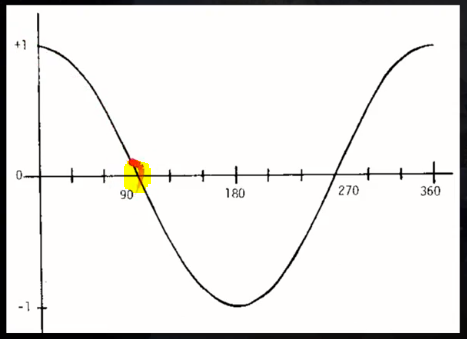

- Angle is 180, Full throttle in the reverse, the opponent is directly behind


- Angle is 270, Zero throttle, the opponent is to the left so turn left

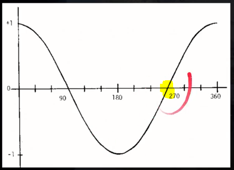

- Angle is 360, Full throttle, the opponent is directly ahead

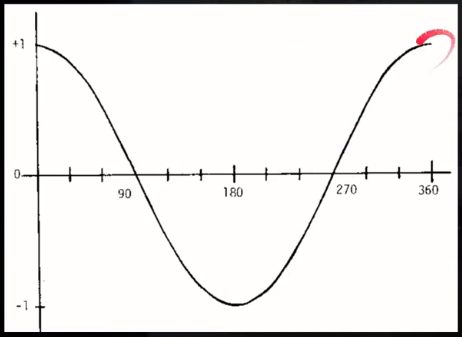

- Dot Product according to Wikipedia


- *Magnitude* of **A** (Tank forward intention) * *Magnitude* of **B** (AI Tank forward intention) * **cosine** of the angle between them (theta)
- *Magnitude*: *size* of **A** or *size* of **B**, we are already is at most **1** since we are already getting the safe normal of each.

- What is Dot Product telling us in basic terms?


***3. Use `FVector::DotProduct()`***

- Dot `AIForwardIntention` & `TankForward`
- Feed result into `IntendMoveForward()`

```cpp
/// TankMovementComponent.cpp

void UTankMovementComponent::RequestDirectMove(const FVector & MoveVelocity, bool bForceMaxSpeed)
{
	// Get unit vectors of the tank's forward direction
	// ...

	// Calculate the forward throw and pass result to `IntendMoveForward`
	auto ForwardThrow = FVector::DotProduct(TankForward, AIForwardIntention);
	
	IntendMoveForward(ForwardThrow);
}
```

### `CrossProduct()` Vector Operator

- **Objective**: Turn the tanks toward the player tank using CrossProduct

- Angle is at 0, target is directly ahead, turn at a rate of 0

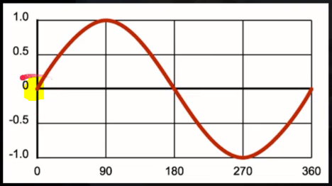

- Angle at 90 degrees, target to the right, turn as fast as possible

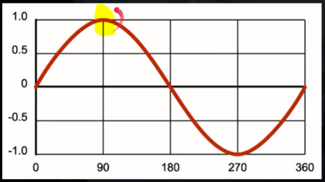

- Angle is 180, target is behind, since we are working with floating point numbers the number will never perseptively be exactly 0


- Angle is 270, target is to the left, turn as fast as possible


- Cross Product according to Wikipedia


- *Magnitude* of **A** (Tank forward intention) * *Magnitude* of **B** (AI Tank forward intention) * **sine** of the angle between them (theta) * *n* the unit vector perpendicular to the plane (world Z axis)

- We get a *Vector* from the Dot Product not a float. This means the turning velocity is a distance from 0 and the dot product. The more perpendicular the angle between the tank and the opponent is, the faster the tank will turn.

- What is Cross Product telling us in basic terms?

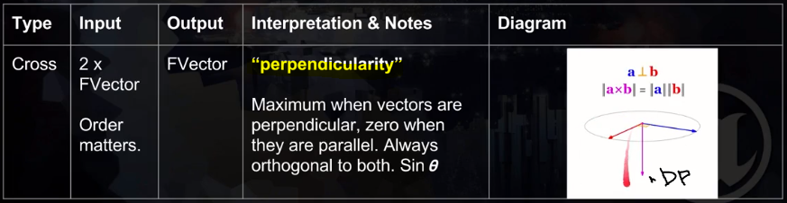

***1. Use `FVector::CrossProduct()`***

***2. Cross `AIForwardIntention` & `TankForward`***

***3. Find the Z component of the resulting vector***

***4. Feed the result to `IntendTurnRight()`***

```cpp
/// TankMovementComponent.cpp

void UTankMovementComponent::RequestDirectMove(const FVector & MoveVelocity, bool bForceMaxSpeed)
{
	// Get unit vectors of the tank's forward direction
	// ...

	// Calculate the forward throw...

    // Calculate the right throw
	auto RightThrow = FVector::CrossProduct(TankForward, AIForwardIntention).Z;
	IntendTurnRight(RightThrow);
}
```

### Finalizing Your Class Code

- **Objective**: Make final changes to TankMovementComponent

### How to Use Blueprint Variables

- **Objective**: Indication of when it will be possible to fire

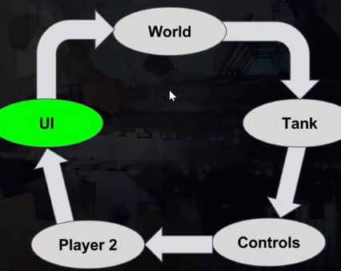

- A way to accomplish our goal is to have an enum attribute on the Aiming Component and create a BP Variable on the Player UI Widget to be able to access this variable.


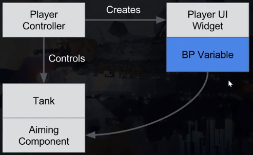

***1. Make `GetControlledTank()` `BlueprintCallable` and in the protected section of the class code so that it is accessible to other objects***

```cpp
/// TankPlayerController.h

UCLASS()
class BATTLETANK_API ATankPlayerController : public APlayerController
{
	GENERATED_BODY()
	
public:
	// public code here...

protected:
	UFUNCTION(BlueprintCallable, Category = Setup)
	ATank* GetControlledTank() const;

// Class declaration cont...
}
```

***2. Create a variable on `PlayerUI_BP` that is of type `TankAimingComponent`***

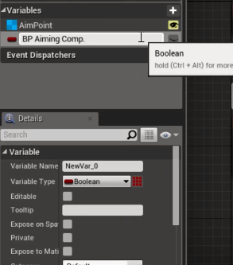


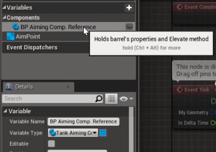

- After saving and compiling the PlayerUI_BP the Set BP Aiming Comp Reference node will be available

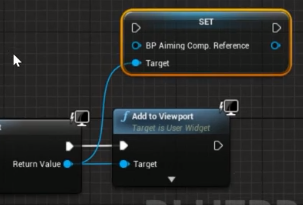

***3. Right click in Event Graph and create a node for `GetControlledTank()`***

***4. We need access to the `TankAimingComponent` but it is not exposed in the code as `BlueprintReadonly` in `Tank.h` yet so do that next***

```cpp
/// Tank.h

UCLASS()
class BATTLETANK_API ATank : public APawn
{
	GENERATED_BODY()

public:
	// public code here...

protected:
	// Provide access to TankAimingComponent in BP
	UPROPERTY(BlueprintReadOnly)
	UTankAimingComponent* TankAimingComponent = nullptr;
// class declaration continued...
}
```

- When project is recompiled it will be accessable


***5. Create binding for crosshair color and opacity***


### Using Enum(erations) in UE4

- **Objective**: Use meaningful way of encoding states and use events to communicate state for reloading.

[Unreal Docs for Strongly Typed Enums](https://docs.unrealengine.com/latest/INT/Programming/Development/CodingStandard/#strongly-typedenums)

***1. Create the Strongly Typed Enum in C++***

- Use the following pattern:
	+ `UENUM()`
	+ `enum class EThing : uint8 {Thing1, Thing2};`
- Specify Reloading, Aiming, & Locked
- Create private member & initialize to Reloading

```cpp
/// TankAimingComponent.h

// Enum for aiming state
UENUM()
enum class EFiringState : uint8
{
	Reloading,
	Aiming,
	Locked
};
//...

//...
class BATTLETANK_API UTankAimingComponent : public UActorComponent
{
	//...
public:	
	//...
protected:
	//...
	UPROPERTY(BlueprintReadonly, Category = State)
	EFiringState FiringState = EFiringState::Reloading;
	//...
private:
	//...
};
```

***2. Create the node graph below in PlayerUI_BP***


### Refactoring our Aiming Component

- **Objective**: Get Aiming Component to the same architecture as the movement component


- `Unreal`

	+ Remove `SetTurretReference` and `SetBarrelReference` from `Tank_BP`

- `Tank`

	+ Remove code for `BeginPlay`, `SetupPlayerInputComponent`, `SetTurretReferece`, `SetTankReference`, `TankAimingComponent` DefaultSubobject

- `TankAimingComponent`
	+ Remove code for `SetBarrelReference`, `SetTurretReference`

	+ Add a new `Initialize` method, like `TankMovementComponent`

- `Unreal`

	+ Create Initialize method in the Event Graph and wire everything up


```cpp
UFUNCTION(BlueprintCallable, Category = Setup)
void Initialize(UTankBarrel* BarrelToSet, UTankTurret* TurretToSet);
```

### Attaching a Debugger to Unreal

- **Objective**: Get familiarized with Unreal Debugging techniques

- Attach a Visual Studio Debugger to the Unreal Process


### Constructor and Begin Play Timing

- **Objective**: Understand exactly what order C++ and BeginPlay methods get called. Using logs to debug the timing.

- Printing in Unreal


- Printing object construction


- Optimize printing during construction by turning of construction on drag


- Filtering the output log using UUID


### Decoupling Your Architecture

- **Objective**: Alternative methods of getting the TankAimingComponent Class, Solving Race Conditions

- Logging Construction and BeginPlay from C++


- Constructors and Begin Play cycles in Unreal


- Key thing to note in this slide is we don't know the order each component will get created in Constructors. The same goes for Begin Play. We can't know for sure when TankAimingComponent will get constructed or when other classes will have access to it.


- To get around these "Race" Conditions in C++, we can use a `GetComponentByClass` function in the TankPlayerContoller_BP Event Graph. That way we can be sure it happens during BeginPlay.


### `BlueprintImplementableEvent`

- **Objective**: Expose C++ function to BP that takes a parameter

- `UFunction(BlueprintImplementableEvent)` does not require you to define the function


- Wiring up the `BlueprintImplementableEvent` in `TankPlayerController_BP`

- Must broadcast the event during `BeginPlay`

```cpp
/// TankPlayerController.cpp

void ATankPlayerController::BeginPlay()
{
	Super::BeginPlay();

	auto AimingComponent = GetControlledTank()->FindComponentByClass<UTankAimingComponent>();
	if (AimingComponent){ FoundAimingComponent(AimingComponent); }
}
```


## Mid-Section Quiz

### Using the ensure Assertion

- **Objective**: Learn a useful new pointer protection technique, the ensure assertion

[Unreal Doc Assertions](https://docs.unrealengine.com/latest/INT/Programming/Assertions/)

- `if (!(LeftTrack && RightTrack)) { return; }` becomes `if (!ensure(LeftTrack && RightTrack)) { return; }`

### Dependency Mapping

- **Objective**: Look through project files and find out what depends on what

**Part 1: Revise Aiming Architecture Graph**


**Part 2: Revise Movement Architecture Graph**


- Go ahead and implement this in the code

- `Tank`
	+ Remove all instances and code related to `TankMovementComponent`

### Talking Head - Real World Skills

### Starting From Green

- **Objective**: First step in making changes to Game Architecture is getting back to functioning code or a "Green" state. Right now, the aiming doesn't work.

- Map the current class structure


- Red, Green, Refactor


- We're going to be gutting the Tank

- First, we can map out the methods for aiming to better understand the dependencies


- Fix an ensure error in `Tank.cpp` by getting the aiming component during `BeginPlay`

```cpp
/// Tank.cpp

void ATank::BeginPlay()
{
	Super::BeginPlay();
	TankAimingComponent = FindComponentByClass<UTankAimingComponent>();
}

```

### Aiming Without the Tank

- **Objective**: Aiming still works and some dependencies have been chopped

- Where we will be after refactoring


- **Overview**: This part of the refactoring process essentially shifts responsibility from Tank to Pawn classes thereby severing the relationship between Tank and Tank Controllers

**Part 1: Tank <-- TankAimingComponent**

- `Tank.h`

	+ Remove references to `UTankAimingComponent`

	+ Remove `AimAt()` declaration, it already exists in `TankAimingComponent.h` however the signature is different

	+ Put a copy of `LaunchSpeed` in `TankAimingComponent.h` and remove `LaunchSpeed` as an argument to `AimAt`

- `Tank.cpp`

	+ Remove references to `UTankAimingComponent`

	+ Get rid of `AimAt()`

***Achievement: Tank decoupled from TankAimingComponent***


**Part 2: TankAimingComponent <-- TankPlayerController**

- `TankAimingComponent.cpp`

	+ Remove `LaunchSpeed` argument from `AimAt` signature

- `TankPlayerController.h`

	+ Remove `GetControlledTank()` method and forward declaration of `ATank`

- `TankPlayerController.cpp`

	+ `ATankPlayerController::GetControlledTank()`

		* Doesn't need to Cast `GetPawn()` into `ATank` so removing that and removing `Tank.h` *will sever another dependency*

	+ `ATankPlayerController::BeginPlay()`

		* `GetControlledTank()` not necessary, all that is needed is `GetPawn()`, so replace it with `GetPawn()`

	+ `ATankPlayerController::AimTowardsCrosshair()`

		* change the test in the beginning to be an `ensure` check for an `AimingComponent`, not a `Tank`

***Achievement: Tanks do not aim but dependency has been removed***


**Part 3: Tank <-- TankAIController**

- `TankAIController.cpp`
	
	+ remove hash include `Tank.h` *severing the dependency to the tank*
	
	+ hash include the `TankAimingComponent.h` *creating a dependency in the Refactoring Graph*

	+ `TankAIController::Tick()`

		* Remove unnecessary Casts of `ATank` for `PlayerTank` and `ControlledTank`

		* Change the test for `PlayerTank` and `ControlledTank` use the new `ensure` pattern i.e. `if (!ensure(PlayerTank && ControlledTank)){ return; }`, also dedent the code that was inside the if clause

		* Instead of calling `AimAt()` from the tank, change that to call from the `AimingComponent`
		
			- First get `AimingComponent`: `auto AimingComponent = ControlledTank->FindComponentByClass<UTankAimingComponent>();`
		
			- Then call it: `AimingComponent->AimAt(PlayerTank->GetActorLocation());`

		* Comment out firing because tank has now been replaced with pawn, don't be concerned with firing at this stage

***Achievement: Tanks will now aim***


### Finish Our Refactoring

- **Objective**: Finish refactoring to the new architecture

- Where we will be after refactoring: Projectile and Barrel dependencies removed, Projectile dependency with AimingComponent created


**Part 1: Enable Firing for the Player Controller**

- *Unreal*

	+ In the `Tank_BP`, delete the Fire function from the Input Setup Graph

- `Tank.h`

	+ Remove references and forward declarations of `Barrel` and `Projectile`

	+ Move `ProjectileBlueprint`, `LaunchSpeed`, `ReloadTimeInSeconds`, `Barrel`, and `LastFireTime` into `TankAimingComponent.h` and remove duplicate lines for creating `Barrel` and `LaunchSpeed`

	+ Make sure all that's left is the code for the constructor

- `Tank.cpp`

	+ Remove hash includes to `Projectile.h` and `TankBarrel.h`

	+ Move the `Fire()` method into `TankAimingComponent.cpp`

	+ Make sure all that's left is the code for the constructor

- `TankAimingComponent.h`

	+ forward declare `AProjectile` in header and hash include in cpp file

- `TankAimingComponent.cpp`

	+ hash include `Projectile.h`

	+ Modify the `Fire()` method to `ensure` the `Barrel` AND `ProjectileBlueprint` both exist, both are required for firing to work

- *Unreal*

	+ Re-bind Input to `Fire()` method (now on the `AimingComponent`) in `Tank_BP`

	+ Remember in TankAiming > Details > Setup > Projectile Blueprint to select Projectile_BP or the project will crash when playing the game

***Achievement: All dependencies on the Tank class have been disconnected***


**Part 2: Enabled Firing for the AI Controller**

- `TankAIController.h`

	+ remove forward declaration of `ATank`

- `TankAIController.cpp`

	+ `Tick()`

		* `AimingComponent->Fire();`

### Adding TickComponent() Back

- **Objective**: Get aiming component ticking again so that we can change the reticle color programmatically

- Fixing issues with Unreal Project


1. Right click goto definition of UActorComponent and copy/paste the function signature into TankAimingComponent.h header file. Also override the `BeginPlay` method.

```cpp
/// TankAimingComponent.h

UCLASS( ClassGroup=(Custom), meta=(BlueprintSpawnableComponent) )
class BATTLETANK_API UTankAimingComponent : public UActorComponent
{
	// ...
private:
	// ...
	virtual void BeginPlay() override;

	virtual void TickComponent(
		float DeltaTime,
		enum ELevelTick TickType,
		FActorComponentTickFunction *ThisTickFunction
	) override;
// Class declaration cont...
};
```

```cpp
/// TankAimingComponent.cpp

void UTankAimingComponent::TickComponent(float DeltaTime, ELevelTick TickType, FActorComponentTickFunction * ThisTickFunction)
{
	UE_LOG(LogTemp, Warning, TEXT("Aiming Comp Ticking"))
}
```

2. `TankAimingComponent.h` override `BeginPlay`

3. `TankAimingComponent.cpp`

	+ initialize the `LastFireTime` variable in `BeginPlay`

```cpp
void UTankAimingComponent::BeginPlay()
{
	// Ensure cannot fire immediately at game start
	// Firing enabled when reload time has elapsed
	LastFireTime = FPlatformTime::Seconds();
}
```

	+ Changes to the `Fire` code

```cpp
void UTankAimingComponent::Fire()
{
	// Begin tracking the firing state using the EFiringState enum
	if (FiringState != EFiringState::Reloading)
	{
		// Spawn a projectile at the socket on the barrel
		if (!ensure(Barrel)) { return; }
		if (!ensure(ProjectileBlueprint)) { return; }
		// cont...
	}
}
```

	+ Begin tracking the firing status in `Tick`

```cpp
void UTankAimingComponent::TickComponent(float DeltaTime, ELevelTick TickType, FActorComponentTickFunction * ThisTickFunction)
{
	// moved here from `Fire` method
	if ((FPlatformTime::Seconds() - LastFireTime) > ReloadTimeInSeconds)
	{
		FiringState = EFiringState::Reloading;
	}
}
```

### Are Two Floats Equal?

- **Objective**: Is the barrel moving? Use `FVector::Equals()` for comparing floats to within a specific tolerance.

**NOTE: Before beginning this lecture, fix an issue where we are able to play the game but TankPlayerController_BP editor not opening and causing an Unreal Editor crash by protecting a nullptr in AimAtCrosshair.**

```cpp
void ATankPlayerController::AimAtCrosshair()
{
	if (!ensure(GetPawn())) { return; }
	auto AimingComponent = GetPawn()->FindComponentByClass<UTankAimingComponent>();
	//...
}
```


1. `TankAimingComponent.h`

```cpp
UCLASS( ClassGroup=(Custom), meta=(BlueprintSpawnableComponent) )
class BATTLETANK_API UTankAimingComponent : public UActorComponent
{
	//...
private:
	FVector AimDirection = FVector(0);

	bool IsBarrelMoving();
// Class declaration cont...
}
```

2. `TankAimingComponent.cpp`

	+ Create `IsBarrelMoving` thin method

```cpp
bool UTankAimingComponent::IsBarrelMoving()
{
	if (!ensure(Barrel)) { return false; }
	return !Barrel->GetForwardVector().Equals(AimDirection, .01);
}
```

	+ Edit the if statement in `TickComponent` to include `IsBarrelMoving`

```cpp
if ((FPlatformTime::Seconds() - LastFireTime) < ReloadTimeInSeconds)
{
	FiringState = EFiringState::Reloading;
}
else if (IsBarrelMoving())
{
	FiringState = EFiringState::Aiming;
}
else
{
	FiringState = EFiringState::Locked;
}
```


### Programmatic Sideways Friction

- **Objective**: Prevent tank from sliding sideways

1. `Track.cpp`

- Calculate slippage speed
- Work out the required acceleration this frame to correct
- Calculate and apply sideways for (F=ma)

- Calculate slippage speed
	+ The component of speed in the tank right direction
	+ If no slippage should be zero
	+ If sliding sideways should be speed
	+ In general use cos of the angle between velocity and the sideways vector
	+ FVecotor::DotProduct()

[Lecture Project Changes](https://github.com/UnrealDeveloperCourse/Section_04/commit/ae096eec645d5188407ce41dae209d27ba5b517e)

### OnComponentHit Event in 4.12

- **Objective**: Detect Component Hit Events

- Tank_BP > Event Graph > Details > Events


- Replacing the contents of this Blueprint with C++


1. Register delegate at `BeginPlay`

```cpp
OnComponentHit.AddDynamic(this, &UTankTrack::OnHit);
```

2. Use this signature found in the Engine source code for the delegate

```cpp
UFUNCTION()
	void OnHit(
		UPrimitiveComponent* HitComponent,
		AActor* OtherActor,
		UPrimitiveComponent* OtherComponent,
		FVector NormalImpulse,
		const FHitResult& Hit
);
```

3. Make `OnHit()` a private `UFUNCTION`

4. Check "Simulation Generates Hit Events"


[Lecture Project Changes](https://github.com/UnrealDeveloperCourse/Section_04/commit/35861a81f910fb150cbc51ceb9b5b539dbb5107d)

### Avoiding Boolean Flags

- **Objective**: Get the physics of the tank to apply only when the tank is in contact with the ground. Have the tank move much more like a tank.

- Select the Tank Component


- Check the collision settings are correct


- Set Damping to make enable deceleration and to mellow the tank rotation while it is not in contact with the ground.


[Ben's Project Changes](https://github.com/UnrealCourse/04_BattleTank/commit/fa5baeb68120e5ce78d214e36cde61643b00e43c)

- Differences in my code: Did not remove `TickComponent` and did not extract `DriveTrack` into separate function. If not, tank would not move predictably or turn very well.

[My Project Changes](https://github.com/UnrealDeveloperCourse/Section_04/commit/35861a81f910fb150cbc51ceb9b5b539dbb5107d)

## Mid-Section Quiz

### Improving Tank Aiming

- **Objective**: No more barrels pointing the wrong way round

[`printf` cplusplus documentation](http://www.cplusplus.com/reference/cstdio/printf/)

- Disable Auto Possess AI on the tanks


**Project Changes**

[Ben's Project Changes](https://github.com/UnrealCourse/04_BattleTank/commit/d06b8d1121c52f35f14d05afb9fcab3fd75db8cc)

[My Project Changes](https://github.com/UnrealDeveloperCourse/Section_04/commit/a54b64ee547e76e400a647f7902d8c29c2d65a04)

### Tweaking Tank AI

- **Objective**: Prevent tanks from firing until they are locked. Increase the max distance between the player tank and AI tanks

**Part 1: `GetFiringState`**

1. Create a getter in the `TankAimingComponent` class to return the `FiringState`

2. Use it to limit the firing of AI tanks to only be when the aiming status is locked

**Part 2: `AcceptanceRadius`**

1. Make a blueprint of the `TankAIController` class

2. Expose `AcceptanceRadius` as `EditAnywhere` for now so that we can test values

3. Code the default `AcceptanceRadius`

[Ben's Project Changes](https://github.com/UnrealCourse/04_BattleTank/commit/cc8b71240db51bdcadc2fe6d5e7d555be985eaa4)

[My Lecture Project Changes](https://github.com/UnrealDeveloperCourse/Section_04/commit/ba54678ef8cf3107d225183e10d9f9f4c2dcabc3)

### Making an Ammo Display

- **Objective**: Make a UI for ammo count

1. Create text object in `PlayerUI_BP` and anchor it

2. Create a binding for text


[Ben's Project Changes](https://github.com/UnrealCourse/04_BattleTank/commit/65346fc7e3ae644bf934877624cde6fa3df34635)


[My Project Changes](https://github.com/UnrealDeveloperCourse/Section_04/commit/b9ecd1630cd175ff7285ea145954da1e838eb1a0)

### Making an AutoMortar

- **Objective**: Reusing AimingComponent to create a stationary mortar entirely in Unreal, no coding.


### Using the Reference Viewer

- **Objective**: Remove Starter Content

### Preparing for Particles

- **Objective**: Getting Set Up to use particles

**Project Changes**

[Ben's Project Changes](https://github.com/UnrealCourse/04_BattleTank/commit/23a580e68a61042829aefc9986feb4f1d6f8178e)

[My Project Changes](https://github.com/UnrealDeveloperCourse/Section_04/commit/574480f04ff6c2b078392cb2b39c25f1586c4930)

### Introducing Particle Systems

- **Objective**: Create a readonly StarterContent Project to copy individual particle assets from. Attach a particle system to the Projectile.

[Wikipedia Particle System](https://en.wikipedia.org/wiki/Particle_system)

### Particle Bounding Boxes

- **Objective**: Fixing smoke trails that disappear

### Using FAttachmentTransformRules

- **Objective**: Create Impact Blasts


- `AttachTo` deprecated

[AttachTo Deprecated](https://community.gamedev.tv/t/attachto-deprecated-in-4-12-and-avoiding-startercontent/15924)

- A new way to attach components

[4.12 Transition Guide](https://forums.unrealengine.com/development-discussion/c-gameplay-programming/84801-4-12-transition-guide?112644-4-12-Transition-Guide=)

**Project Changes**

[Ben's Project Changes](https://github.com/UnrealCourse/04_BattleTank/commit/01641a7e2889d4235a7994332193d144955ba426)

[My Project Changes](https://github.com/UnrealDeveloperCourse/Section_04/commit/643b0efcb82b6234dfe1b29dddaf8598b4ffa437)

## Mid-Section Quiz

### Radial Forces & Caching

- **Objective**: Apply forces on impact from projectiles

- Have a look at force components that we could potentially add via Blueprint


- Add the Explosion Force Component in C++ much the same way we added `LaunchBlast` and `ImpactBlast` Particle Components to the Projectile 


[Wikipedia Impulse Force](https://en.wikipedia.org/wiki/Impulse_(physics))

- Impulse force is the area beneath the curve


**Project Changes**

[Ben's Project Changes](https://github.com/UnrealCourse/04_BattleTank/commit/44390db5d88ff4a819692fbe5ab57d6f56e69750)

[My Project Changes](https://github.com/UnrealDeveloperCourse/Section_04/commit/15cb5d65079ce15f75f313b1c9bae6bdf291b25e)

### Using GetTimerManager()

- **Objective**: Make the projectiles dissappear after a resonable time period


- Destroy on timer expire manages cleaning up scene objects automatically


**Project Changes**

[Ben's Project Changes](https://github.com/UnrealCourse/04_BattleTank/commit/cf78a29c66a0ddcd9ed1733c2aa0c7939332735e)

[My Project Changes](https://github.com/UnrealDeveloperCourse/Section_04/commit/c71300c5984ddbf7ae13b53d23bb8c2b82345197)

### Using TakeDamage() on Actors

- **Objective**: Start to take damage

**Project Changes**

[Ben's Project Changes](https://github.com/UnrealCourse/04_BattleTank/commit/e964687a28cc4c808079976c1d13826af3ca8c84)

[My Project Changes](https://github.com/UnrealDeveloperCourse/Section_04/commit/9d2454e0aad2f7a9a11960c20876ffe50f88bfee)

### BlueprintPure & Health Bars

- **Objective**: Blue health bars

**NOTE: If blue bar disappears, remove and add `MyTank` in `HealthBar_BP` `GetPercent` Blueprint function

- What is BlueprintPure according to the documentation

> The function does not affect the owning object in any way and can be executed in a Blueprint or Level Blueprint graph.

- Create Widget Component


- Create Widget Blueprint


- Create a progress bar


- Scale the anchor of the progress bar to fill the entire canvas

- Fill the progress bar to the entire canvas by setting offsets to zero


- Select the HealthBar Class in the Widget Component


- Create a `GetHealthPercent` method that returns the current health percentage

- Test the heath percentage is working in Blueprint


**Set the location of the widget to the location of the Tank on screen**

- Create Blueprint Variable "MyTank" of type `Tank`


- Get Health Percent in Get Percent Binding


- Setup Tank_BP Event Graph

- Widget Component -> Get User Widget Object -> Cast to HeathBar_BP -> Set MyTank Widget


- Collapse group and rename to `InitializeHealthBarWidget`


- Position and Scale the Heath Bar Widget in the Tank_BP Viewport and select Screen Space


**Project Changes**

[Ben's Project Changes](https://github.com/UnrealCourse/04_BattleTank/commit/e964687a28cc4c808079976c1d13826af3ca8c84)

[My Project Changes](https://github.com/UnrealDeveloperCourse/Section_04/commit/f4ba04efd310a925cfa649f347644e0f2ca6b8d0)

### The Observer Pattern

- **Objective**: Learn about Observer Pattern which is like an Event/Subscription Model. Broadcast an OnDeath.Broadcast() event on the Tank class and have the Tank Controllers subscribed to that event react accordingly.

**Links**

[Observer Pattern](http://gameprogrammingpatterns.com/observer.html)

[Declaring Delegates](https://docs.unrealengine.com/latest/INT/Programming/UnrealArchitecture/Delegates/index.html#declaringdelegates)

[Dynamic Delegates](https://docs.unrealengine.com/latest/INT/Programming/UnrealArchitecture/Delegates/Dynamic/)

[DMCDs or Muli-Cast Delegates](https://docs.unrealengine.com/latest/INT/Programming/UnrealArchitecture/Delegates/Multicast/)

**Steps for Setting-Up DMCDs**

1. Create type: DECLARE_DYNAMIC_MULTICAST_DELEGATE(FSubjectName);

2. Declare: FSubjectName OnSomethingHappened;

3. Broadcast: OnSomethingHappened.BroadCast();

4. Declare delegate on listener(s):
UFUNCTION()  // Must be a UFUNCTION to get called
void DelegateMethod();  // e.g. void OnTankDeath();

5. To register: BroadcastingInstance-> OnSomethingHappened. AddUniqueDynamic(this, &AListenerClass::DelegateMethod);

**Project Changes**

[Ben's Project Changes](https://github.com/UnrealCourse/04_BattleTank/commit/d1d54647c9656082fc46c779a6d50909af1ce75d)

[My Project Changes](https://github.com/UnrealDeveloperCourse/Section_04/commit/74571afa9bf40fe43619a1494648c52af5226347)

### Finishing Off - Part 1

- **Objective**: Apply the same OnDeath delegate to the player controller, On death, player controller: go into spectator mode, AI controller: detatch

[DetachFromControllerPendingDestroy](https://docs.unrealengine.com/latest/INT/API/Runtime/Engine/GameFramework/APawn/DetachFromControllerPendingDestr-/index.html)

[StartSpectatingOnly](https://docs.unrealengine.com/latest/INT/API/Runtime/Engine/GameFramework/APlayerController/StartSpectatingOnly/index.html)

**Project Changes**

[Ben's Project Changes](https://github.com/UnrealCourse/04_BattleTank/commit/80932adb8c6b793d353715c35da9993e3ace3183)

[My Project Changes](https://github.com/UnrealDeveloperCourse/Section_04/commit/c2516816446326332af0ef2d4fc41d7d38049d43)

### Finishing Off - Part 2

- **Objective**: Additional turret, undulate the terrain

### Section 4 Wrap-Up

- **Objective**: Improve Room Escape, apply what you've learned

### Bonus - Switching Cameras

- **Objective**: Third to First person view camera switching

## End of Section Quiz
